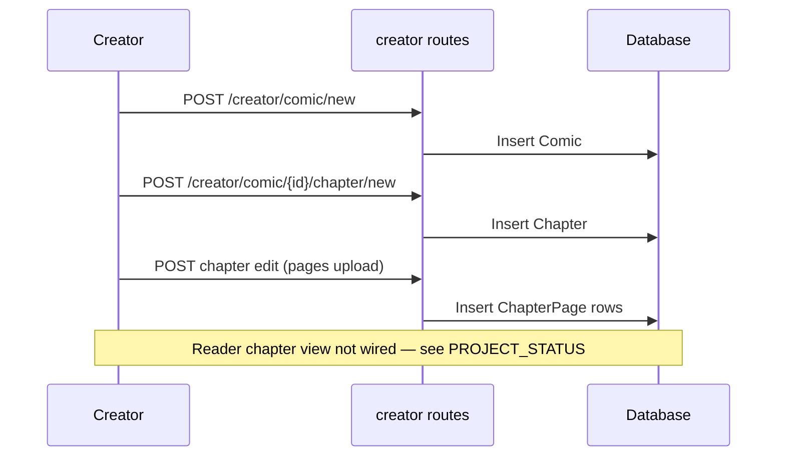

# AmarKatha architecture

Flask monolith for an Indian comics platform: readers discover and read content; creators publish via a dashboard; admins curate and moderate.

## Stack

| Layer | Technology |
|-------|------------|
| Web framework | Flask 3.0 |
| ORM / DB | SQLAlchemy, PostgreSQL (Docker) or SQLite (local default) |
| Auth | Flask-Login; optional Google OAuth via Flask-Dance |
| Migrations | Flask-Migrate (Alembic) |
| Frontend | Jinja2 templates, Bootstrap 5, inline CSS in `base.html` |
| Deploy | Docker Compose, Gunicorn-capable `run.py`, optional HTTPS |

## Application layout

```
AmarKatha/
├── app/
│   ├── __init__.py      # App factory, blueprint registration, OAuth
│   ├── models.py        # Domain models
│   ├── routes/
│   │   ├── main.py      # Reader: home, search, comic detail
│   │   ├── auth.py      # Register, login, become-creator, Google
│   │   ├── creator.py   # Creator dashboard & publishing
│   │   └── admin.py     # Moderation & metrics (artist-gated)
│   ├── templates/
│   └── static/
├── config.py            # Config classes + .env
├── run.py               # Entry point, CLI (init-db, create-admin)
├── migrations/          # Alembic revisions
└── docker-compose.yml   # Local dev stack (see docs/docker.md)
```

## Blueprints

| Prefix | Module | Responsibility |
|--------|--------|----------------|
| `/` | `main` | Public discovery and reading |
| `/` | `auth` | Sessions, registration, Google OAuth |
| `/creator` | `creator` | Artist-only publishing and stats |
| `/admin` | `admin` | Platform management (see status doc for access model) |

## Data model (summary)

```
User ──┬── Comic ─── Chapter ─── ChapterPage
       │      └── Rating, ComicFollow, ViewLog
       └── Series ── (optional) Comic.series_id
       └── Follow (user-to-user)

Chapter ── Comment, ChapterRating
```

- **Comic** is the primary publishable unit (title, genre, cover, schedule, editor pick flag).
- **Series** groups comics; optional `schedule` on series and comic.
- **Chapter** holds ordered **ChapterPage** images; supports `scheduled_publish`.
- **ViewLog** is intended for trending/dwell analytics but is not written from reader routes yet.

## Request flow (creator publish)



## Configuration

| Variable | Role |
|----------|------|
| `SECRET_KEY` | Flask sessions |
| `DATABASE_URL` | SQLAlchemy URI |
| `FLASK_ENV` | development / production |
| `OAUTH_INSECURE_TRANSPORT` | Allow HTTP OAuth in dev |
| Google JSON / env | `google_credentials.json` or `GOOGLE_OAUTH_*` |

Uploads land in `app/static/uploads/` (max 16MB per `config.py`).

## Operations

- **Health**: `GET /health` on the app from `run.py`
- **DB init**: `flask init-db` or migrations via `./scripts/dev.sh migrate`
- **Docker**: `./setup.sh` or `docker compose up -d` — see [docker.md](./docker.md)

For feature completeness and known gaps, see [PROJECT_STATUS.md](./PROJECT_STATUS.md).
