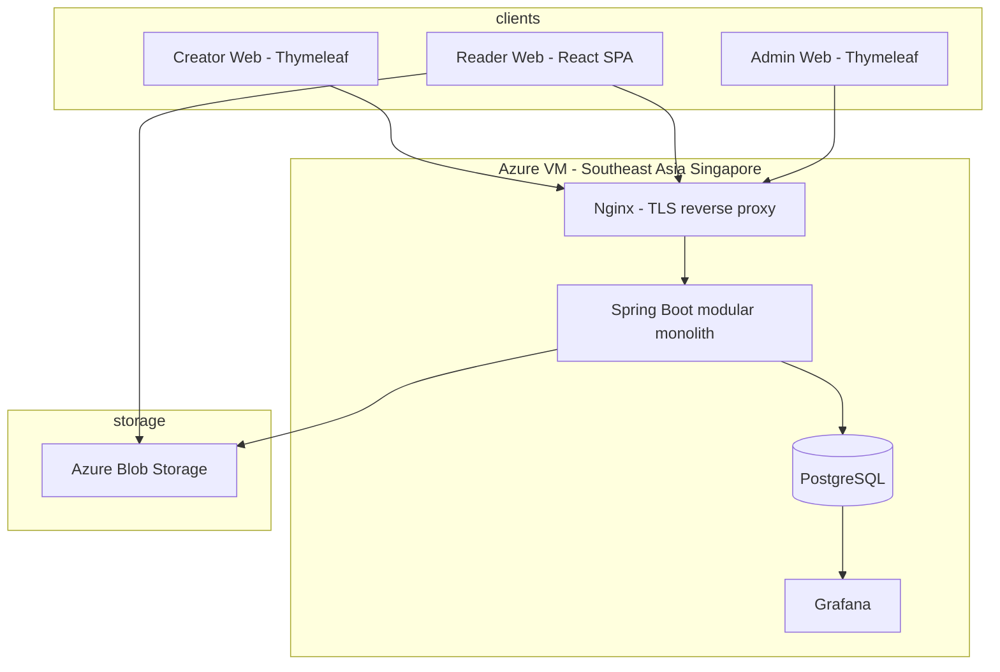
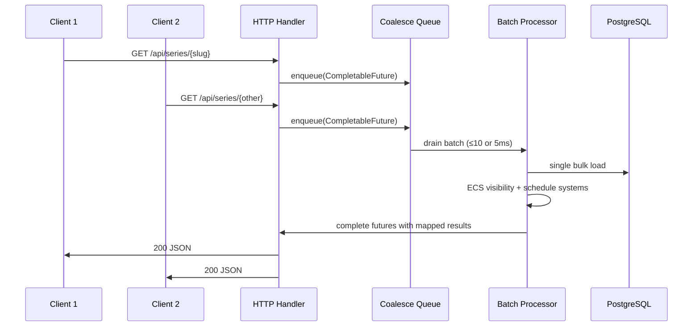
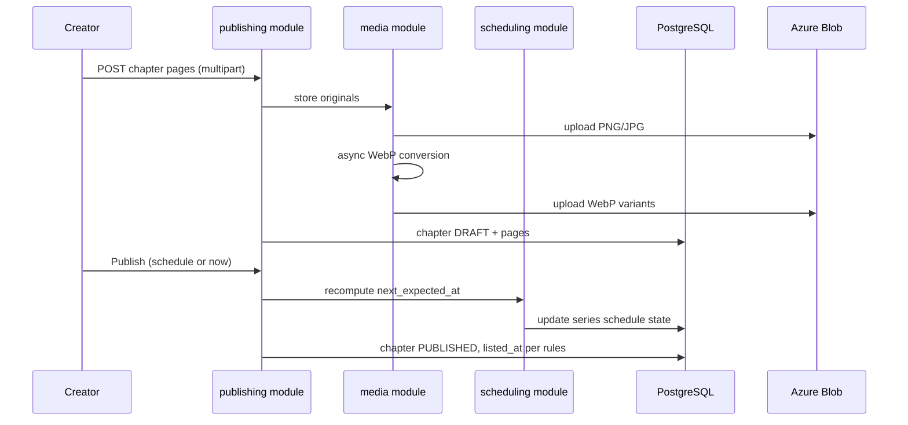

# Architecture

## System context



**V0 deployment:** single VM + Docker Compose (`nginx`, `app`, `postgres`, `grafana`). No Kubernetes. Scale vertically until V1 traffic warrants CDN and managed DB.

---

## Modular monolith

One Spring Boot application, **hard module boundaries** enforced by package structure and ArchUnit tests (recommended). Modules communicate via **application services** and **domain events** — not direct cross-module entity access.

```
com.amarkatha
├── bootstrap/          # Spring Boot main, config, Flyway
├── shared/             # i18n, feature flags, common types, coalescing infra
├── identity/           # OAuth, users, roles, invite tokens
├── catalog/            # Homepage, public series listing, genres (V1)
├── publishing/         # Series, chapters, pages, upload orchestration
├── scheduling/         # Pure schedule domain + ECS systems
├── reader/             # Public API for React reader, OG meta endpoints
├── media/              # Blob I/O, WebP pipeline, signed URLs
├── analytics/          # Event ingestion, aggregates, Grafana export
├── admin/              # Token gen, stipends, takedowns, reports
└── payments/           # V0: interfaces + schema stubs only
```

### Module dependency rules

| Module | May depend on |
|--------|----------------|
| `shared` | JDK, Spring core only |
| `identity` | `shared` |
| `scheduling` | `shared` (pure domain — no Spring Web) |
| `publishing` | `shared`, `scheduling`, `media` |
| `catalog` | `shared`, `publishing` (read models only) |
| `reader` | `shared`, `catalog`, `publishing`, `scheduling`, `analytics` |
| `analytics` | `shared` |
| `admin` | `shared`, `identity`, `publishing`, `analytics` |
| `payments` | `shared` (stubs in V0) |

---

## Entity Component System (Dominion)

Use **[dominion-ecs-java](https://github.com/dominion-dev/dominion-ecs-java)** for **hot-path domain logic** where data-oriented design pays off:

- Schedule recomputation across many series (batch admin jobs)
- Catalog/homepage assembly (many series + latest chapter + schedule strip)
- Analytics aggregation queries (reader return batches)

### ECS vs traditional layers

| Use ECS (Dominion) | Use classic Spring services + JPA |
|--------------------|-------------------------------------|
| Read-heavy, batch-friendly paths | CRUD, auth, admin forms |
| Schedule engine pure computation | File upload, OAuth callbacks |
| Request-coalesced visibility/catalog assembly | Flyway migrations, config |
| In-memory compute over loaded components | Transactional writes to PostgreSQL |

### Component sketch (catalog read path)

```
Entity: SeriesEntity (Dominion entity id maps to series PK)

Components:
  SeriesMeta       { slug, title, coverUrl, contentLanguage, status }
  ScheduleState    { cadence, nextExpectedAt, lastPublishedAt, skipMessage }
  LatestChapter    { chapterId, chapterNumber, publishedAt, listedAt }
  Visibility       { isPublic, isListedOnCatalog, scheduledAt }

Systems:
  LoadSeriesBatchSystem     — bulk load by IDs (one JDBC round-trip)
  ApplyVisibilitySystem     — compute listed vs unlisted for catalog
  SortByRecencySystem       — homepage ordering
```

Dominion entities are **runtime compute handles**, not replacements for JPA entities. Pattern:

1. **Write path:** Spring service → JPA → PostgreSQL (source of truth).
2. **Read path:** Coalesced request → load components from DB (batch) → ECS systems → DTO response.

---

## Request coalescing

Apply the pattern from [Request Coalescing For Backend APIs](https://medium.com/@pankajbasnal17/request-coalescing-for-backend-apis-c2d4a1702a50) on **concurrent identical-class reads**:

- Homepage catalog fetch
- Series detail + schedule strip
- Chapter metadata + page URLs (not image bytes — those come from blob/CDN)

### Algorithm (batch size + max wait)

| Parameter | V0 default |
|-----------|------------|
| Max batch size | 10 requests |
| Max wait | 5 ms |
| Queue | Per-endpoint or shared `catalog-read` queue |

### Flow



**Do not coalesce:** writes, auth, upload, admin mutations.

Implementation lives in `shared/coalescing/` — generic `CoalescingQueue<K, Req, Res>` reusable across reader endpoints.

---

## API surface split

| Surface | Consumer | Style |
|---------|----------|-------|
| `/creator/**` | Thymeleaf | Server-rendered MVC + form posts |
| `/admin/**` | Thymeleaf | Server-rendered MVC |
| `/api/reader/**` | React SPA | JSON REST |
| `/api/reader/og/**` or SSR fragment | Crawlers (WhatsApp, etc.) | HTML with OG meta (see [frontend.md](./frontend.md)) |
| `/health` | Ops | Plain text / Actuator |

React reader is a static bundle served by Nginx at `/read/**` (or root for public paths). Creator/admin remain session-cookie authenticated on same origin.

---

## Data flow — publish chapter



WebP conversion may complete asynchronously; reader API serves WebP when ready, falls back to original JPEG with `Accept` negotiation until conversion done.

---

## Cross-cutting concerns

| Concern | Approach |
|---------|----------|
| i18n | Spring `MessageSource`; keys in `shared/i18n/` |
| Feature flags | `application.yml` + DB table for runtime toggles (`invite_required`, etc.) |
| Idempotency | Publish/skip actions use optimistic locking on `series.version` |
| Timezone | Store UTC; display IST (`Asia/Kolkata`) in V0 |
| CORS | Same-origin for V0; React served from same Nginx host |
| Observability | Spring Actuator metrics → Prometheus → Grafana |

---

## Technology stack

| Layer | Choice |
|-------|--------|
| Runtime | Java 25, Spring Boot 3.4+ |
| Web | Spring MVC, Spring Security |
| Persistence | Spring Data JPA + Flyway |
| ECS | dominion-ecs-java |
| Creator UI | Thymeleaf, HTMX (optional for skip/hiatus modals) |
| Reader UI | React 19 + Vite, TypeScript |
| DB | PostgreSQL 16 |
| Blob | Azure Blob Storage |
| Reverse proxy | Nginx |
| Metrics | Micrometer + Prometheus + Grafana |
| Build | Maven or Gradle (pick one at bootstrap) |

---

## Expansion hooks (no V0 implementation)

- `NotificationOutbox` table — email/push in V1
- `Subscription` / `Plan` / `Entitlement` stubs — see [v1-foundation-hooks.md](./v1-foundation-hooks.md)
- `MediaStore` interface — swap blob provider
- `PaymentProvider` interface — Razorpay/Stripe India later
- Cloudflare in front of Nginx when domain is ready

---

## Related documents

- [domain-model.md](./domain-model.md) — entities and tables
- [scheduling-engine.md](./scheduling-engine.md) — schedule logic detail
- [scope-and-timeline.md](./scope-and-timeline.md) — what to build when
