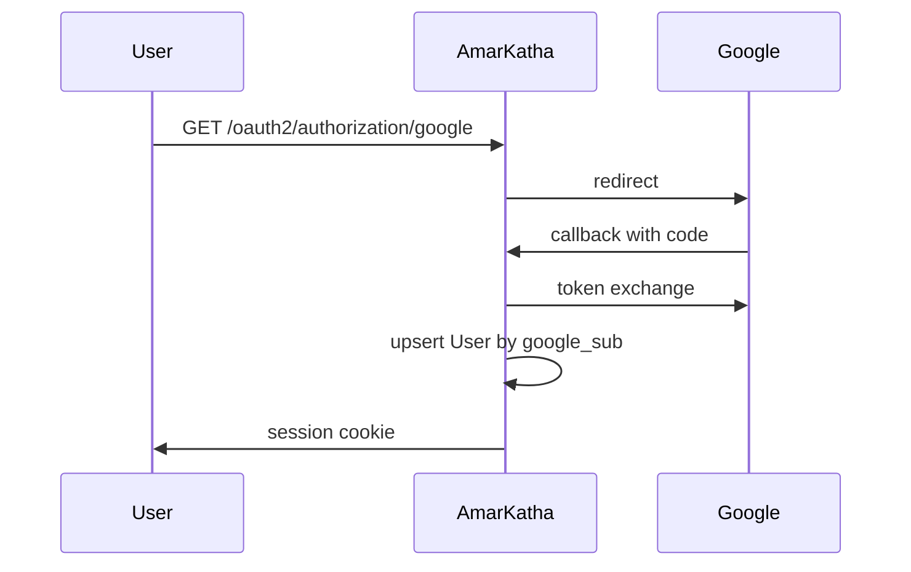
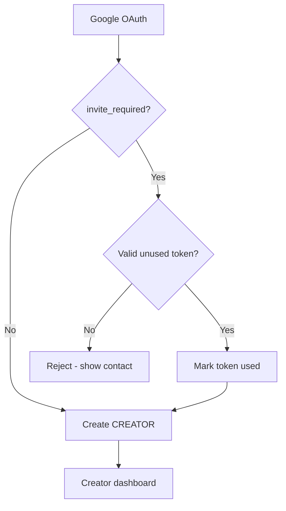

# Identity and Auth

## Overview

| Actor | Auth method | V0 |
|-------|-------------|-----|
| **Reader** | None | Anonymous cookie for analytics only |
| **Creator** | Google OAuth | Required |
| **Admin** | Google OAuth + `ADMIN` role | Founder only at launch |

No email/password in V0. Product updates to creators via **email** (manual or transactional later).

---

## Google OAuth (creators + admins)

### Flow

### Spring Security config

- OAuth2 Login with Google provider
- Session cookie: `HttpOnly`, `Secure`, `SameSite=Lax`
- CSRF enabled on Thymeleaf forms
- React reader routes: public, no CSRF on GET API

### User record

| Field | Source |
|-------|--------|
| `google_sub` | Google ID token |
| `email` | Google profile |
| `display_name` | Google profile |
| `role` | Default `READER`; promoted to `CREATOR` on onboard; `ADMIN` set manually in DB or admin UI |

**Admin bootstrap:** seed first admin via Flyway migration or `application.yml` admin email list.

---

## Invite token flow

Gated by feature flag **`invite_required`** (default `true`).

### Creator onboarding

### Token rules

| Rule | Detail |
|------|--------|
| Generation | Admin portal — cryptographically random, URL-safe |
| Single use | Set `used_at`, `used_by` on signup |
| Expiry | Optional `expires_at` (recommend 30 days) |
| Storage | Hash token at rest (SHA-256) if paranoia; plaintext OK for V0 low volume |

### Signup UX

- Path: `/creator/signup?invite={token}` or enter token on form post-OAuth
- Invalid/expired/used token: friendly error + “Contact AmarKatha” email

---

## Roles and authorization

| Role | Permissions |
|------|-------------|
| `READER` | Default; no creator routes (unused if anonymous read) |
| `CREATOR` | Own series/chapters only |
| `ADMIN` | Invites, stipends, reports, takedown any content, view Grafana links |

Use Spring Security method security: `@PreAuthorize("hasRole('CREATOR')")`.

**Ops team:** small; V0 has one admin (founder). Schema supports multiple admins via role assignment.

---

## Reader anonymous identity

Not authentication — **analytics correlation only**.

| Cookie | Purpose |
|--------|---------|
| `reader_id` | UUID, 1-year, `HttpOnly`, `SameSite=Lax`, no PII |

Set on first chapter view. Used with `series_id` for return-after-skip metric. Document in privacy notice (minimal footer link).

No GDPR-scale compliance doc in V0, but cookie banner optional for India DPDP awareness.

---

## Session vs API

| Surface | Auth |
|---------|------|
| `/creator/**`, `/admin/**` | Server session |
| `/api/reader/**` | Public read; no bearer token |
| Future subscription API | JWT or session — stub in [v1-foundation-hooks.md](./v1-foundation-hooks.md) |

---

## Email

V0: **no automated email** required for launch.

Planned uses (V0.1 / V1):

- Creator: missed schedule reminder, chapter published confirmation
- Admin: new content report received
- Reader: subscription notifications (V1)

Use Azure Communication Services or SMTP when added; store `NotificationOutbox` rows now (empty table OK).

---

## Security checklist (V0)

- [ ] HTTPS only (Let’s Encrypt on Nginx)
- [ ] Google OAuth redirect URIs locked to production domain
- [ ] Admin routes require `ADMIN` role (not merely authenticated)
- [ ] Invite tokens single-use
- [ ] Rate limit OAuth and signup endpoints (Nginx or Bucket4j)
- [ ] No secrets in repo; Azure Key Vault or env vars

---

## Related documents

- [domain-model.md](./domain-model.md) — `User`, `InviteToken`
- [security-ops-legal.md](./security-ops-legal.md) — IT Rules, grievance
- [v1-foundation-hooks.md](./v1-foundation-hooks.md) — reader accounts for subscriptions
