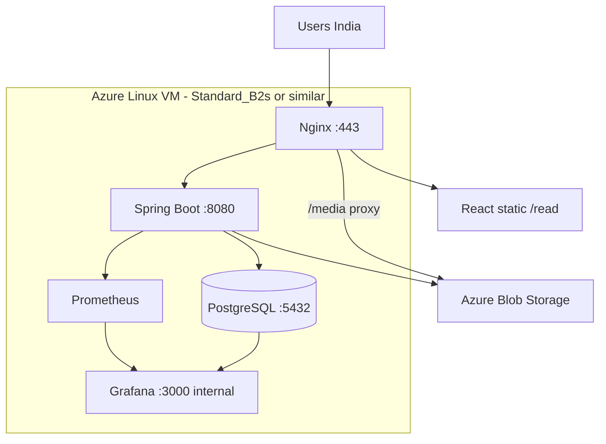

# Infrastructure and Deployment

## Region strategy

**Primary region:** Azure **Southeast Asia (Singapore)** (`southeastasia`).

| Factor | Notes |
|--------|-------|
| Latency to India | ~50–80ms typical — acceptable for API; images matter more (CDN later) |
| Tax / entity | **Not decided in this doc** — verify GST, PE, and billing entity with accountant before revenue |
| Credits | ~₹10k/month Azure credits + free-tier VM |

**Alternative if tax/compliance favors India:** `centralindia` (Pune) — swap region in Terraform/Compose comments when decided.

---

## V0 topology

Single VM — no Kubernetes.



---

## Docker Compose (production on VM)

```yaml
# Conceptual services
services:
  nginx:
    ports: ["80:80", "443:443"]
    volumes: [./nginx.conf, ./certbot, react-dist:/var/www/read]
  app:
    build: .
    environment:
      SPRING_PROFILES_ACTIVE: prod
      DATABASE_URL: jdbc:postgresql://postgres:5432/amarkatha
      AZURE_STORAGE_CONNECTION_STRING: ${AZURE_STORAGE_CONNECTION_STRING}
  postgres:
    image: postgres:16
    volumes: [pgdata:/var/lib/postgresql/data]
  prometheus:
  grafana:
```

---

## Domain and Cloudflare (not yet)

| Stage | Setup |
|-------|-------|
| **V0 dev/pilot** | Azure public IP or `*.cloudapp.azure.com` + Let's Encrypt |
| **Pre-marketing** | Register domain; point NS to **Cloudflare** (free) |
| **Post-domain** | Cloudflare → Nginx; orange-cloud proxy; cache `/media/*` |

Document DNS cutover checklist when domain is acquired.

---

## TLS

- **Certbot** on VM with Nginx plugin
- Auto-renew via cron
- Force HTTPS redirect

---

## Azure Blob Storage

| Setting | Value |
|---------|-------|
| Account type | StorageV2 |
| Redundancy | LRS (V0 cost) |
| Container | `media` (private) |
| Access | Connection string in env; Nginx proxy for public reads |

Backup: optional cross-region replication deferred.

---

## Database

- PostgreSQL 16 on same VM (V0)
- **Nightly `pg_dump`** to blob storage (cron)
- Connection pool: HikariCP default tuning

**Upgrade path:** Azure Database for PostgreSQL Flexible Server when credits allow and ops burden grows.

---

## Compute sizing (starting point)

| Resource | Spec |
|----------|------|
| VM | Standard_B2s (2 vCPU, 4 GiB) or free-tier equivalent |
| Disk | 64 GB SSD |
| Blob | Pay per use (~₹ within credits for V0) |

Monitor CPU during WebP conversion bursts; queue conversions if pegged.

---

## Environments

| Env | Purpose |
|-----|---------|
| `local` | Docker Compose on laptop; filesystem media store |
| `prod` | Single Azure VM |

Staging optional — solo timeline may use `local` + prod only.

---

## Deployment process (V0)

1. Build JAR + React `dist`
2. SCP or `git pull` on VM
3. `docker compose up -d --build`
4. Flyway migrates on app start
5. Smoke test: `/health`, upload test chapter, reader load

CI/CD (GitHub Actions) nice-to-have in week 4 if time permits.

---

## Secrets management

| Secret | Storage |
|--------|---------|
| DB password | `.env` on VM, not in git |
| Google OAuth client secret | env |
| Azure storage connection string | env |
| Grafana admin password | env |

Rotate on compromise; Azure Key Vault when team grows.

---

## Cost guardrails

| Monitor | Action if exceeded |
|---------|-------------------|
| Blob egress | Enable Cloudflare caching |
| VM CPU sustained &gt;80% | Throttle WebP concurrency |
| Credits burn rate | Alert at 70% monthly credits |

---

## Related documents

- [media-pipeline.md](./media-pipeline.md) — blob layout
- [architecture.md](./architecture.md) — system diagram
- [analytics-and-observability.md](./analytics-and-observability.md) — Grafana on same VM
