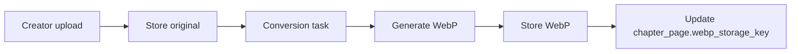

# Media Pipeline

Image-heavy chapters dominate bandwidth and storage cost. V0 optimizes for **Indian readers on weak networks** while keeping creator uploads simple.

---

## Upload constraints

| Limit | Value |
|-------|-------|
| Formats accepted | PNG, JPG, JPEG, WebP |
| Max file size | **16 MB** per page |
| Typical chapter size | **20–30 pages** |
| Max pages per chapter | **40** (configurable) |
| PDF | Deferred (V1) |

Creators upload **originals**; platform generates **reader-facing WebP**.

---

## Storage layout (Azure Blob)

```
amarkatha-media/
  series/{seriesId}/cover/
    original.jpg
    cover-800.webp          # OG / thumbnail
  chapters/{chapterId}/pages/
    {pageOrder}-original.jpg
    {pageOrder}-reader.webp
    {pageOrder}-reader-low.webp   # optional V0.1
```

**Region:** same as compute — **Azure Southeast Asia (Singapore)** unless blob egress to India proves costly (monitor in Grafana).

Use **`MediaStore` interface** in `media/` module:

```java
interface MediaStore {
    UploadResult putOriginal(String key, InputStream data, String contentType);
    UploadResult putDerivative(String key, InputStream data, String contentType);
    URL publicUrl(String key);          // or signed URL if bucket private
    void deletePrefix(String prefix);
}
```

V0 implementation: `AzureBlobMediaStore`. Local dev: `FilesystemMediaStore`.

---

## WebP conversion pipeline

### Flow



### V0 implementation options

| Option | Complexity | Recommendation |
|--------|------------|----------------|
| **In-process** (thumbnailator + webp-imageio or libwebp JNI) | Low | **Start here** for solo 4-week timeline |
| **Async worker thread** in Spring | Low | Run conversion off HTTP thread |
| **Azure Function** on blob trigger | Medium | V1 if CPU becomes bottleneck |

### WebP settings (starting point)

| Variant | Max width | Quality | Use |
|---------|-----------|---------|-----|
| `reader.webp` | 800px | 82 | Mobile scroll default |
| `reader-low.webp` | 480px | 75 | Optional `Save-Data` / query param |
| `cover-800.webp` | 800px | 85 | OG image, homepage cards |

Preserve originals for creator re-download and future re-encoding.

### Publish gating

| Flag | Behavior |
|------|----------|
| `webp_required = false` (V0 default) | Publish allowed; reader falls back to JPEG until WebP ready |
| `webp_required = true` | Block list-on-catalog until all pages have WebP |

Show creator UI indicator: “Optimizing for readers…” with progress.

---

## Delivery to reader

### V0 (no Cloudflare yet)

```
Browser → Nginx → proxy /media/* to Azure Blob (or serve from local disk in dev)
```

Nginx cache headers:

```
Cache-Control: public, max-age=31536000, immutable
```

Use content-hash or version in storage key path for cache busting on re-upload.

### V1 (domain + Cloudflare)

- Cloudflare free tier in front of Nginx
- Optional transform rules for WebP negotiation

---

## Reader API response shape

```json
{
  "chapterId": "...",
  "pages": [
    {
      "order": 1,
      "webpUrl": "https://host/media/.../1-reader.webp",
      "fallbackUrl": "https://host/media/.../1-original.jpg",
      "width": 800,
      "height": 1280
    }
  ]
}
```

React uses `webpUrl` first; on error, `fallbackUrl`.

---

## Bandwidth estimates (planning)

Assumptions: 25 pages × 150 KB WebP ≈ **3.75 MB per chapter read**.

| Monthly reads | Egress (approx) |
|---------------|-----------------|
| 1,000 | ~3.7 GB |
| 10,000 | ~37 GB |

Azure blob egress pricing should fit within ₹10k credits for V0 validation volumes. Monitor in admin/Grafana.

---

## Security

- Blob container **private**; serve via Nginx authenticated proxy OR short-lived SAS tokens embedded in API response (V0: Nginx proxy simpler)
- Validate MIME type on upload (magic bytes, not just extension)
- Strip EXIF if privacy concern (optional V0.1)
- Virus scan: defer until scale

---

## Copyright

On publish, creator must check:

> “I confirm I own the rights to upload this content, or I have permission from the copyright holder.”

Store `copyright_ack_at` timestamp on `Chapter`.

---

## Related documents

- [domain-model.md](./domain-model.md) — `ChapterPage` fields
- [frontend.md](./frontend.md) — lazy load in React reader
- [infrastructure.md](./infrastructure.md) — Azure blob setup
