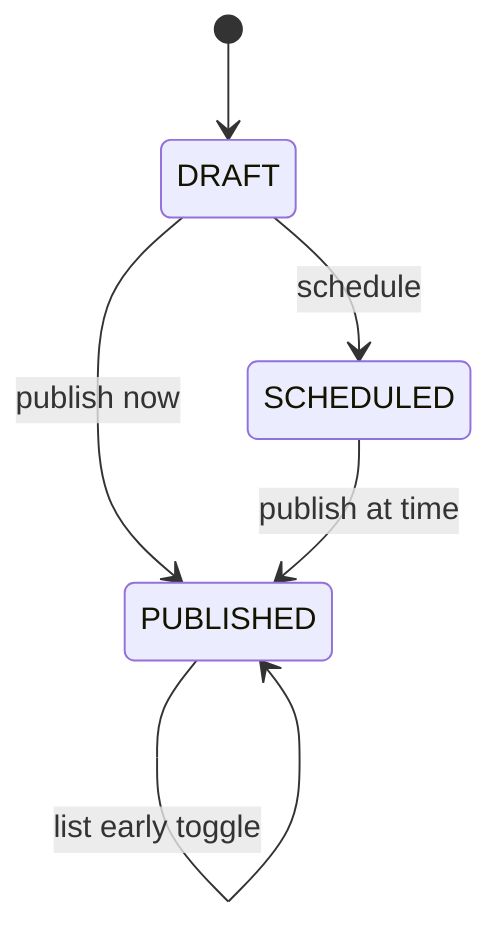
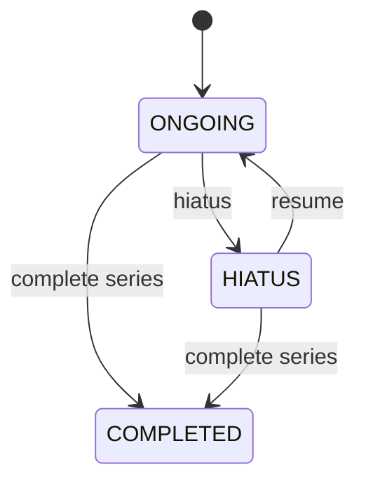

# Scheduling Engine

Scheduling is the **core product differentiator** for V0. Implementation is a **pure domain module** (`scheduling/`) with heavy unit test coverage. No cron or auto-publish in V0.

Related product spec: [publishing-tool-hl-prd.md](../product/publishing-tool-hl-prd.md) §5.3 (V0 column).

---

## Principles

1. **Schedule is a promise, not a prison** — skips shift the calendar; they don't orphan content.
2. **Series is the scheduling unit** — chapters inherit cadence context.
3. **Reader truth** — share page shows exactly what the creator set.
4. **IST display, UTC storage** — all datetimes persisted as UTC; UI defaults to `Asia/Kolkata`.

---

## Series schedule state

| Field | Meaning |
|-------|---------|
| `cadence` | `OFF` \| `WEEKLY` \| `BIWEEKLY` |
| `day_of_week` | 1–7 (Mon–Sun) anchor when cadence active |
| `next_expected_at` | Next reader-facing update date (nullable in hiatus) |
| `last_published_at` | Last chapter listed or published (for calendar math) |
| `skip_message` | Optional ≤280 chars shown on reader series page |
| `status` | `ONGOING` \| `HIATUS` \| `COMPLETED` |

### Default cadence

- New series: **`cadence = OFF`**
- After **2nd chapter published**, prompt creator to set weekly/biweekly (non-blocking)

---

## Cadence activation

When creator sets weekly/biweekly:

```
next_expected_at = nextOccurrence(day_of_week, from = max(now, last_published_at), timezone = IST)
```

`nextOccurrence` returns start-of-day in IST converted to UTC for storage, or end-of-day if product prefers “updates on Friday” copy — **pick one in implementation and test it**.

---

## Actions and effects

### Publish now

| Step | Effect |
|------|--------|
| Chapter → `PUBLISHED` | Set `published_at = now` |
| Visibility | Apply list-early / scheduled_at rules (see [domain-model.md](./domain-model.md)) |
| Calendar | If cadence active: **`next_expected_at = advanceOnePeriod(from = now)`** |
| | Update `last_published_at` |
| Audit | `ScheduleEvent(PUBLISH_EARLY)` if before prior `next_expected_at` |

**Early publish advances calendar:** confirmed.

### Schedule for datetime

| Step | Effect |
|------|--------|
| Chapter → `SCHEDULED` until publish job | V0: creator manually publishes at time (no cron) |
| On publish action at/after scheduled time | Same as publish now |
| Missed manual date | V0: no auto-publish; optional email to creator (defer email to V0.1 if time-constrained) |

### Skip next slot

| Step | Effect |
|------|--------|
| Requires active cadence | Error if `cadence = OFF` |
| `next_expected_at` | **`+= one period`** (7 or 14 days) |
| `skip_message` | Optional creator input, ≤280 chars |
| Reader UI | Schedule strip shows new date + message |
| Audit | `ScheduleEvent(SKIP, skip_message)` |

**Skip note:** included in V0.

Example reader copy:

> Next update: **Friday, 21 June**  
> *“Exams this week — thanks for waiting!”*

### Hiatus

| Step | Effect |
|------|--------|
| `status` → `HIATUS` | |
| `next_expected_at` | Cleared (null) |
| Return date | **Not collected in V0** |
| Reader UI | Hiatus banner; no next date |
| Audit | `ScheduleEvent(HIATUS)` |

### Resume from hiatus

| Step | Effect |
|------|--------|
| `status` → `ONGOING` | |
| If cadence active | `next_expected_at = nextOccurrence(day_of_week, from = now)` |
| If cadence OFF | `next_expected_at = null` |
| Audit | `ScheduleEvent(RESUME)` |

---

## Publish visibility vs schedule

Separate concerns:

| Concept | Field(s) | Purpose |
|---------|----------|---------|
| **Content live** | `published_at` | Pages accessible via direct share URL |
| **Catalog listed** | `listed_at`, `scheduled_at`, `list_early` | Visible on series list + homepage |

**Typical flows:**

1. **Publish now, list now:** `scheduled_at = now`, `listed_at = now`
2. **Publish now, list later:** `published_at = now`, `scheduled_at = Friday 8pm`, `listed_at = null` until Friday (unless `list_early`)
3. **List early:** creator toggles `list_early` → `listed_at = now` while keeping `scheduled_at` for messaging if desired

V1 **early access / patron tiers** will add entitlement checks on the direct link; V0 direct link is open to anyone with URL.

---

## State machines

### Chapter lifecycle



### Series status



---

## IST edge cases (must test)

| Case | Expected |
|------|----------|
| Skip on week boundary | `next_expected_at` lands on correct weekday in IST |
| Publish 23:30 IST Friday | Calendar anchor consistent with `day_of_week` |
| DST | IST has no DST — use `ZoneId.of("Asia/Kolkata")` only in V0 |
| Biweekly skip twice | +28 days total |

Unit tests in `scheduling/` should not depend on Spring context.

---

## Integration with ECS

Batch job (optional V0 admin tool): recompute stale `next_expected_at` for all ONGOING series — loads `ScheduleState` components into Dominion, runs validation system, writes back discrepancies.

Hot read path: when assembling series page, `ScheduleState` + `Visibility` components joined in coalesced catalog load (see [architecture.md](./architecture.md)).

---

## Analytics coupling

On `ScheduleEvent(SKIP)`:

- Record event for Grafana
- Start **return-after-skip window** for readers who viewed previous chapter (see [analytics-and-observability.md](./analytics-and-observability.md))

Primary validation metric: **≥40% of prior chapter readers return within 7 days of new `next_expected_at`**.

---

## V1 additions (not V0)

- Auto-publish at `scheduled_at` (Spring `@Scheduled` or worker)
- Auto-queue next draft chapter
- Monthly / custom N-day cadence
- Creator timezone selection
- Hiatus with optional return date + email to followers
- Missed-slot email reminders

---

## Open implementation notes

| Item | Recommendation |
|------|----------------|
| Period length | Weekly = 7 days; biweekly = 14 days (calendar days, not “every 2nd Tuesday” unless specified — document in code) |
| Float chapter display | Show as “Episode 1.5” on reader |
| Concurrent skip + publish | Serialize on `series.version` optimistic lock |
