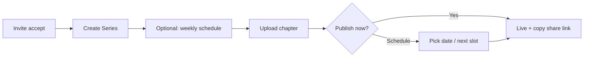

# AmarKatha Publishing Tool — High-Level Product Requirements

**Document type:** High-level PRD (HL-PRD)  
**Audience:** Design, engineering, QA, and downstream spec authors  
**Purpose:** Define publishing surface area and scheduling behavior, scoped for **lean validation (V0)** first  
**Status:** Draft v0.2 (revised per [india-market-analysis-feedback.md](./india-market-analysis-feedback.md))  
**Related:** [mvp-goal.md](./mvp-goal.md) · [creator-dashboard-requirements.md](../planning/creator-dashboard-requirements.md)

---

## 1. Executive summary

AmarKatha's publishing tool lets indie comic artists **upload, schedule, and share** chapters with a schedule that tolerates real life — **skip a cycle or go on hiatus without breaking the calendar**.

**Scope discipline:** The full vision below describes the **complete publishing product**. **V0 (validation launch)** implements only the subset in §3 and §9.1. Do not build calendar views, auto-publish, or cross-series queue until [mvp-goal.md](./mvp-goal.md) V0 kill criteria pass.

**V0 bet:** Scheduling is a **retention tool for creators already publishing**, acquired via invite + share links — not a supply hook vs WEBTOON alone.

---

## 2. Problem & product principles

### 2.1 Problem

Indie comic artists want a predictable release rhythm, but rigid tools punish missed weeks and force awkward workarounds. Indian creators often publish on **Instagram or WEBTOON first**; any AmarKatha schedule must work when **most audience is off-platform**.

### 2.2 Goals

| Goal | V0 signal | V1+ signal |
|------|-----------|------------|
| Publishing is fast | Upload → scheduled in &lt;5 min | Same |
| Schedules are trustworthy | Share-page shows correct next date | + push/email when available |
| Skips are painless | Skip in ≤2 actions | Same |
| Creator anxiety down | Clear draft / scheduled / live | + buffer depth, queue |
| Validates hypothesis | Reader return after skip ≥40% | Creator 30-day retention ≥60% |

### 2.3 Design principles

1. **Schedule is a promise, not a prison** — Skips shift the calendar; they don't orphan content.
2. **Series is the scheduling unit** — Chapters inherit cadence; overrides are explicit.
3. **States are obvious** — Draft → Scheduled → Published (V0); Unlisted/Archived in V1.
4. **Reader truth** — What creators set is what the share page shows.
5. **Share-first distribution (V0)** — Link-out is the primary reader acquisition path.
6. **Mobile web for reading** — Upload desktop-ok; status + skip on mobile web.

---

## 3. Personas

| Persona | V0 needs | Notes |
|---------|----------|-------|
| **Instagram-first Indian artist** | Publish + share link; optional cadence | Won't configure schedule unless friction is near-zero |
| **Solo webtoon artist** | Weekly + skip when sick | May dual-publish on WEBTOON |
| **Part-time storyteller** | Biweekly + hiatus between arcs | |
| **Returning creator** | Resume after hiatus | V0: manual resume only |

---

## 4. Information architecture — page inventory

### 4.1 V0 pages (validation launch)

| Page | Job | V0 must provide |
|------|-----|-----------------|
| **Creator Home** | What’s due soon | Next slot, draft warning, quick upload — no analytics wall |
| **Become Creator / invite accept** | Onboarding | Profile + first series |
| **Series Detail** | Command center | Metadata, schedule, chapter list, **share link**, skip/hiatus |
| **Chapter Editor** | Upload + publish | Image pages, reorder, publish now / schedule |
| **Schedule Settings** | Cadence | Weekly or biweekly + day; IST default |
| **Skip / Hiatus** | Miss a cycle | Skip next slot; hiatus with optional return date |
| **Reader view (share URL)** | Read + trust schedule | Vertical scroll, schedule strip, hiatus banner |

### 4.2 V1+ pages (after validation)

| Page | Deferred from V0 because |
|------|--------------------------|
| **Library (all content)** | Invite-only cohort is small |
| **Publish Queue (cross-series)** | Single-series focus suffices |
| **Calendar view** | List/date on series detail enough for V0 |
| **Notifications Center** | No native app; email in V1 |
| **Chapter / series analytics** | View counts on admin suffice |
| **Announcements** | Schedule strip + hiatus banner enough |
| **Publishing Preferences** | Hardcode IST until multi-region |

Full page inventory for V1+ is retained in §4.3–4.6 for downstream specs.

### 4.3 Entry & orientation (V1+)

| Page | Job |
|------|-----|
| **Creator Home (full)** | Upcoming publishes, schedule health, activity |
| **Onboarding** | Profile, series or standalone path |

### 4.4 Content hierarchy (V1+)

| Page | Job |
|------|-----|
| **Library** | Search, filter, bulk actions |
| **Series List** | All series, cadence badges |
| **Comic / Work Detail** | Standalone titles |
| **Chapter Editor (full)** | PDF, preview modes |

### 4.5 Publishing & schedule (V1+)

| Page | Job |
|------|-----|
| **Publish Queue** | Cross-series list (+ calendar V1.1) |
| **Chapter Publish Modal** | Auto-queue, pin slot |

### 4.6 Quality, analytics, settings (V1+)

Reader preview (enhanced), upload session at scale, analytics pages, notifications, public creator profile.

---

## 5. System capabilities

### 5.1 Content model

- **V0 hierarchy:** Creator → Series → Chapter → Image pages
- **V0 content:** PNG/JPG/WebP only; max **16MB/file** (align with app config); PDF/text in V1
- **Chapter number:** Float supported; no phantom numbers on skip

### 5.2 Lifecycle states

| State | V0 | V1+ |
|-------|-----|-----|
| **Draft** | ✅ | ✅ |
| **Scheduled** | ✅ (manual datetime or next slot) | ✅ + lock window |
| **Published** | ✅ | ✅ + limited edit rules |
| **Unlisted / Archived** | — | ✅ |

### 5.3 Scheduling engine

#### V0 engine (validation)

| Capability | V0 | V1+ |
|------------|-----|-----|
| Cadence: weekly, biweekly | ✅ | ✅ |
| Cadence: monthly, custom N days, irregular | — | ✅ |
| Manual “publish on date” | ✅ | ✅ |
| Skip next slot | ✅ | ✅ |
| Hiatus + resume | ✅ | ✅ |
| Publish early / late flows | Simplified (publish now updates strip) | Full §5.3 rules |
| Auto-queue | — | ✅ |
| Auto-publish at slot time | — | ✅ |
| Timezone | IST only, stored UTC | Creator TZ |
| Drag-reschedule | — | ✅ |

**V0 skip behaviors (minimum):**

| Action | Behavior | Reader-facing (share page) |
|--------|----------|----------------------------|
| **Skip next slot** | Next date += one period | Updated “Next update” |
| **Hiatus** | No next slot until resume | “On hiatus” + optional return date |
| **Resume** | Next slot from return date or next weekday | Normal strip |

**V1+ skip behaviors (full):** Publish early/late, pin slot, missed-slot policy — see prior spec; implement after V0.

#### V1+ cadence types

Weekly, biweekly, monthly, custom interval, irregular (manual queue only).

### 5.4 Queue & automation

| Capability | V0 | V1+ |
|------------|-----|-----|
| Ordered chapter list on series | ✅ | ✅ |
| Auto-queue | — | ✅ |
| Buffer depth signal | — | ✅ |
| Creator email reminder | — | Optional V1 |
| Auto-publish | — | ✅ |
| Push notifications | — | With native app |

### 5.5 Upload & media

- **V0:** Multi-image upload, reorder, basic validation
- **V1+:** PDF, thumbnails, retry, compression pipeline

### 5.6 Reader comms

- **V0:** Schedule strip on series share page; hiatus banner; optional 280-char note on skip
- **V1+:** Email on publish; push with app; precise publish time toggle

### 5.7 Permissions & safety

- **V0:** Invite-only creators; creator owns content; delete with confirm; admin report/remove
- **V1+:** Full moderation playbook, copyright/IP process

### 5.8 Analytics hooks

| Event / metric | V0 | V1+ |
|----------------|-----|-----|
| `published_at`, `skip_reason` | ✅ | ✅ |
| Chapter view count | ✅ | ✅ |
| Reader return after skip | ✅ **primary** | ✅ |
| Creator 30-day retention | ✅ | ✅ |
| Cost per published chapter | Manual tracking | Automated |
| Schedule adherence % | — | ✅ (benchmark vs reader retention, not vanity) |

---

## 6. Primary workflows

### 6.1 V0 — First publish (share link)



### 6.2 V0 — Skip a cycle


### 6.3 V1+ workflows

Steady-state auto-publish, cross-series queue, running-late flows — implement per prior §6.2–6.4 when V1 approved.

### 6.4 V0 navigation

```
Creator Home → Series Detail → Chapter Editor
              ↘ Share link (reader view)
Series Detail → Schedule / Skip / Hiatus
```

---

## 7. Page responsibility matrix (V0 priority)

| Page | Detail spec must answer |
|------|-------------------------|
| **Series Detail** | Inline skip vs modal; share link prominence |
| **Chapter Editor** | Image-only limits; publish vs schedule default |
| **Schedule Settings** | Default weekly; skip if Instagram-first persona skips |
| **Share page** | Mobile scroll; schedule strip copy in English (+ Indic in V1) |
| **Skip / Hiatus** | Reader return tracking event fired when |

---

## 8. Downstream documents

**V0 (write first):**

1. **V0 Scheduling Spec** — weekly/biweekly, skip math, IST, hiatus only
2. **Series Detail + Chapter Editor** — upload and publish
3. **Share-page reader** — scroll + schedule strip
4. **Skip / Hiatus UX** — copy and analytics events

**V1+ (after kill criteria pass):** Auto-queue, publish queue, notifications, full scheduling engine spec.

---

## 9. Scope boundaries

### 9.1 V0 — in scope

- Image chapter upload + reorder
- Weekly/biweekly + manual date
- Skip next slot + hiatus/resume
- Draft / scheduled / published
- Series share link + reader view
- Schedule strip + hiatus on reader page
- View counts + skip/return analytics

### 9.2 V0 — out of scope

- Auto-publish, auto-queue, calendar UI
- PDF/text upload, 50MB batches
- Cross-series publish queue
- WCAG 2.1 AA certification (basic accessibility only)
- Comments/ratings in publish tool
- Monetization, tips, UPI (see mvp-goal Phase 1.5)

### 9.3 V1+ — in scope (when approved)

Full HL-PRD: cadence types, auto-publish, queue, notifications, unlisted/archive, library.

### 9.4 V2+

Bulk schedule, A/B covers, RSS/email subscribers, catch-up mode, co-creators.

---

## 10. Non-functional requirements

| Area | V0 | V1+ |
|------|-----|-----|
| **Performance** | Series page &lt;2s on 4G | Queue &lt;2s for 50 items |
| **Reliability** | Manual publish ok if cron fails | Scheduled publish retry |
| **Mobile** | Reader mobile web first | Creator queue on mobile |
| **Accessibility** | Semantic HTML, readable contrast | WCAG 2.1 AA target |
| **Localization** | English UI; India genres/tags | One Indic language |

---

## 11. Open decisions

| # | Decision | V0 recommendation |
|---|----------|-------------------|
| 1 | Early publish advances calendar? | Yes, default |
| 2 | Irregular series copy | “Updates occasionally” on share page |
| 3 | Missed manual schedule date | Email creator; no auto-publish |
| 4 | Instagram-first default cadence | Off by default; prompt after 2nd chapter |

---

## 12. Success metrics

### V0 (90 days)

| Metric | Target |
|--------|--------|
| Invited creators with ≥2 chapters | ≥20 / 50 |
| Active series using skip or hiatus | ≥30% |
| **Reader return after skip** (within 7d of next date) | ≥40% |
| Creators with weekly/biweekly set | ≥50% of active |
| Creator 30-day retention | ≥60% |
| Share-link traffic share of reads | Establish baseline |

### V1+ (if V0 passes)

Prior targets (60% scheduled creators, etc.) apply only at platform scale — secondary to reader retention after skip.

---

## 13. How to use this document

1. **Ship V0 only** — §3.1, §5.3 V0 column, §9.1.  
2. **Design** — Series Detail, Chapter Editor, share-page reader, skip/hiatus.  
3. **Engineering** — Simple schedule fields before cron auto-publish.  
4. **PM** — Track reader return after skip, not creator adherence alone.  
5. **Review** — [india-market-analysis-feedback.md](./india-market-analysis-feedback.md) before expanding scope.
