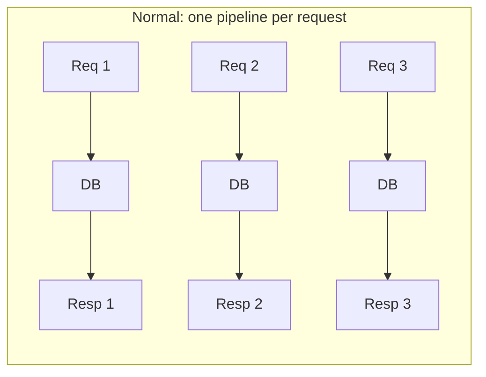
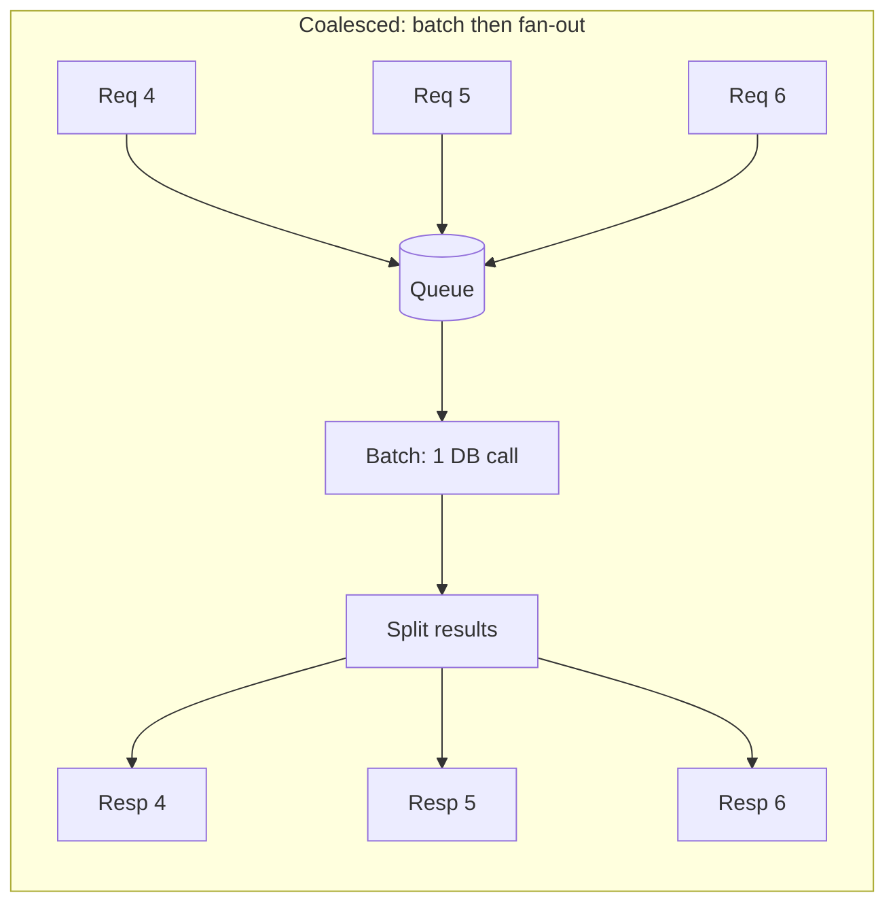
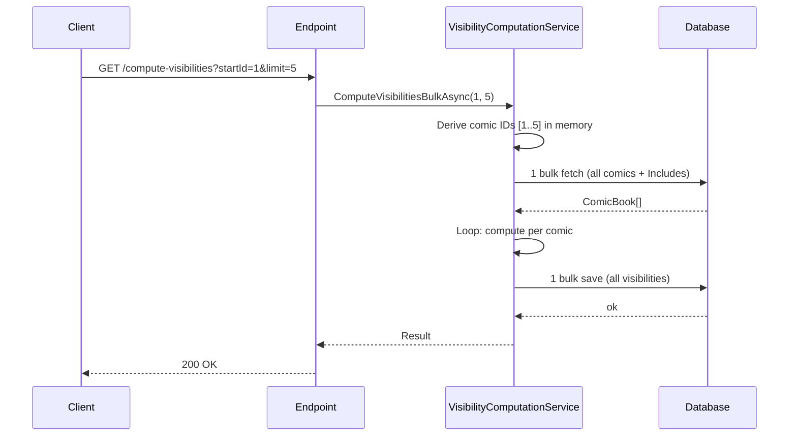
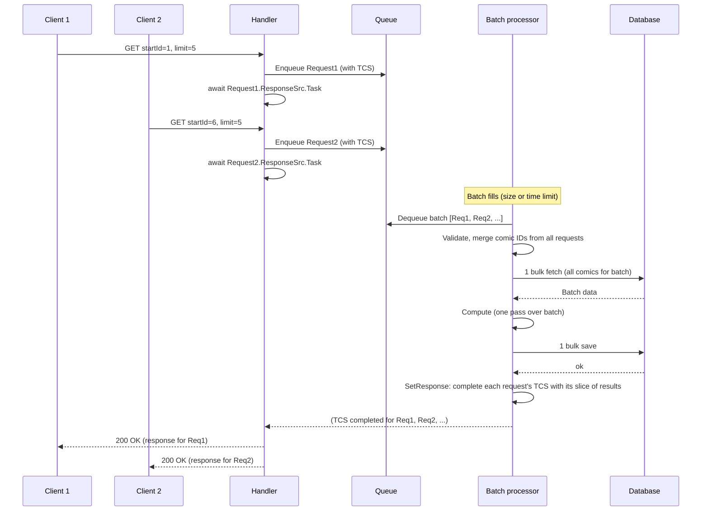
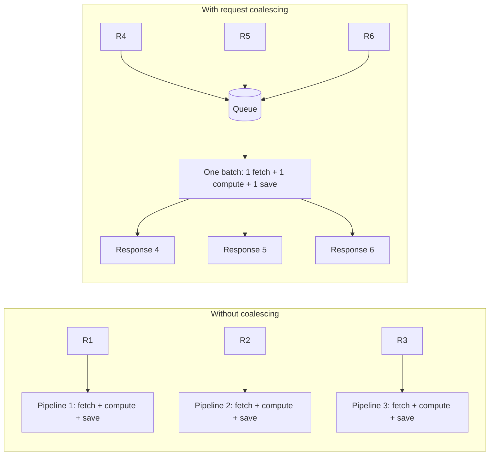

# Request Coalescing (4–5× Throughput)

## Expectation

I came across **Discord’s engineering blog** where they describe their **data-service** using **request coalescing** to fetch messages from the database: instead of one DB round-trip per client request, they batch many incoming requests and serve them with fewer, larger fetches. It’s a backend design pattern—same idea as bulk loads or batch inserts, but applied at the request boundary.

I wanted to see what impact this pattern would have if a normal API used it. So I took a small, read-heavy endpoint (compute visibility for a range of comics), added a queue and a batch processor that coalesces requests, and compared it to the version that handles each request on its own. This article is what I tried and what I measured.

**What request coalescing is:** When many clients hit the same kind of work at once (e.g. “give me data for these IDs”), instead of running one pipeline per request you collect requests over a short time window, process them together in a **batch** (one DB round-trip, one compute pass), then map results back to each caller. You trade a bit of queueing delay for fewer DB round-trips and less per-request overhead. In backend terms, that’s request coalescing (or request batching).

My expectation going in was simple: higher throughput under load, lower average and tail latency, and less per-request overhead by doing work in batches. I didn’t expect magic, but I did expect enough improvement to justify the added complexity (queue, batch logic, mapping results back).

---

## Motivation: Discord’s data-service and going deeper on coalescing

The inspiration came from **Discord’s engineering blog**: their **data-service** uses request coalescing to fetch messages—many clients asking for data get batched into fewer DB round-trips. I wanted to try the same idea on a normal API. Before that, here’s a bit more on what coalescing can look like and how it differs from the usual flow.

### Normal flow vs coalesced flow

In the **normal** flow, every request gets its own pipeline. Concurrent requests don’t share work: N clients mean N DB calls (and N compute passes, if each request does its own).

In a **coalesced** flow, requests are grouped before hitting the heavy resource (e.g. the database). One batch of work is done once; results are then split and returned to the right callers.

So the trade-off: you add a **queueing** step and a **mapping** step (which result goes to which request), and in return you do fewer round-trips and less repeated work when traffic is concurrent.

### Different ways to coalesce

Coalescing can be implemented in a few ways; the choice affects latency and throughput.

- **Time-window (fixed window):** Collect all requests that arrive in the next N milliseconds, then process that set in one go. Simple, but if traffic is sparse you might add latency (e.g. a single request waits up to N ms). Good when you have steady, bursty traffic.

- **Batch size + max wait (what we used):** Try to fill a batch of size N (e.g. 10 requests). If the queue fills up before that, process immediately; if not, process whatever you have after a short max wait (e.g. 5 ms). So you don’t wait forever for a full batch, but under load you still pack many requests per batch. This balances latency (low wait when traffic is low) and throughput (bigger batches when traffic is high).

- **Key-based / deduplication:** Multiple requests for the *same* key (e.g. same resource ID, same query) are merged into one backend call; all waiters get the same result. Common in caches and read-through layers (e.g. “many callers ask for user X → one fetch, then fan-out”). Best when you expect duplicate requests for the same key.

In this experiment I used the **batch size + max wait** approach: a background loop dequeues up to 10 requests or waits up to 5 ms, then runs one DB fetch and one compute pass for the batch and maps results back. The next sections describe the setup and the exact batching logic from the code.

I decided to try it on a small API: an endpoint that computes visibility for a range of comics (each request asks for a few comic IDs). Under load, many requests would hit the same kind of work—fetch data, compute, maybe save. I added a queue and a background batch processor, then compared it to the version that handled each request on its own. This article is not “I found the perfect architecture.” It’s “here’s what I tried and what I learned.”

---

## Setup: Comic visibility scenario (fabricated but practical)

To test this, I used a fabricated backend scenario that is still close to real production patterns.

Imagine an API that computes comic book visibility based on:

- geography rules
- customer segment rules
- release timing
- pricing and other content flags

Each request asks for visibility of multiple comics (e.g. `startId` and `limit`). During load, many requests come in around the same time. Instead of handling each request independently, I coalesced them: incoming requests are enqueued, and a background processor handles them in batches.

### Baseline (no coalescing)

- One request processed at a time: each HTTP call runs its own pipeline (one bulk fetch, compute, one bulk save). No sharing across concurrent requests.
- 10 concurrent clients mean 10 separate DB round-trips and 10 separate compute passes.

### With request coalescing

- Incoming requests are enqueued; a background processor dequeues them in **batches** (see next section for how batching works).
- One bulk fetch and one bulk save per batch; one compute pass over the batch. Results are mapped back to each original request via an index map so every client gets the right response.

The next section has sequence diagrams and the concrete batching logic from the code.

### Why I expected improvement

The biggest expected gain was from changing the *shape of work*:

- fewer DB round-trips (one per batch instead of one per request)
- one compute pass per batch instead of per request
- less per-request overhead on the hot path

---

## Architecture: Without vs with request coalescing

The main difference is *when* work runs and *how many* requests share one DB round-trip. Below is the flow for each design, then the batching details from the implementation.

### Without coalescing: One request, one pipeline

Each HTTP request is handled on its own. The endpoint calls the service and waits for the full computation. There is no batching across requests: 10 concurrent clients mean 10 separate pipelines, each doing its own fetch and save.

So for one request we do **1 fetch + 1 save**. Under load we still have **one pipeline per request**: no sharing of work across concurrent callers.

### With request coalescing: Queue and batch processor

Here, the HTTP handler does **not** do the work. It validates the request, enqueues a small message (with a `TaskCompletionSource` so the HTTP call can wait), and returns only when that request has been processed as part of a **batch**. A background host dequeues requests in batches, merges all their comic IDs, does **one** fetch and **one** save for the whole batch, then completes every request in that batch by setting their result on the TCS. So multiple HTTP requests share one DB round-trip and one compute pass.

The batch processor keeps an **originalIndices** map so it knows which slice of the batch result belongs to which enqueued request. When it calls `SetResponse`, it completes each request’s `TaskCompletionSource` with the right response. The handler’s `await request.ResponseSrc.Task` then returns and the HTTP response is sent.

### How batching works (from the code)

The batch processor is built on a small queue abstraction. Here’s how batching is implemented so that we don’t wait forever for a full batch, but we still group requests when traffic is high.

- **Queue:** A `ConcurrentQueue<T>`. Each incoming request is turned into a message (with a `TaskCompletionSource`) and **enqueued**; the HTTP handler then awaits the TCS.

- **Dequeue(batchSize):** To form a batch, we try to fill a list with up to `batchSize` items (e.g. 10). We loop: `TryDequeue` and add to the batch. If the queue is **empty**, we don’t return immediately—we allow a short **max batching time** (e.g. **5 ms**) so that a few more requests can arrive. So we return when either we have `batchSize` items or 5 ms has passed, whichever comes first. That way we don’t add too much latency when traffic is low (we process whatever we have after 5 ms), and we pack more work per batch when traffic is high.

- **BatchDequeue loop:** A long-running loop runs in the background. Each iteration:
  1. Calls `Dequeue(batchSize)` to get a batch (up to 10 items, or less after a 5 ms wait).
  2. If the batch is empty (no requests arrived in that window), we count empty cycles; after **5 consecutive empty dequeues**, we back off with a short delay (e.g. **2 ms**) so we don’t busy-spin when idle.
  3. If the batch has items, we invoke the **callback** with `(batchCount, messageBatch)`. The callback does the single bulk fetch, compute, bulk save, and `SetResponse` for each request in the batch.
  4. After processing a batch, we wait **batchDequeueTimeoutMs** (e.g. **10 ms**) before the next `Dequeue`. That small gap helps avoid hammering the queue and gives a natural pacing between batches.

So the main knobs are: **batch size** (e.g. 10 requests per batch), **max batching time** (5 ms) when the queue is empty, and **delay between batches** (10 ms). In this experiment the API used `batchSize = 10`; the exact values can be tuned for latency vs throughput.

### Side-by-side: where the difference comes from

**Without coalescing** = one pipeline per request (each with its own fetch and save). **With request coalescing** = many requests enqueued, then processed in batches so many requests share one fetch and one save.

---

## Load test results

I ran the same load test against both versions to compare how much traffic each could sustain before timeouts became a problem.

### Test setup

I used **k6** with a ramping-arrival-rate scenario: request rate starts at 2 RPS and ramps up over 7 minutes (2 → 5 → 10 → 20 → 30 → 40 → 50 → target RPS), then holds at the target for 2 minutes. Each request hits the compute-visibilities endpoint with a small range of comic IDs (`startId` and `limit`). Requests use a 1.5s timeout so we can tell when the server returns 504. The idea is to find the highest RPS the API can handle while keeping success rate high and timeouts low.

Same script, same machine, same target RPS for both—only whether the backend used request coalescing or not.

### Results

**Without coalescing:**

- **Max sustainable throughput:** ~60 RPS. Beyond that, timeouts dominate.
- Total requests: 23,199 | Success rate: 36.53% | Timeout rate: 63.06%
- Avg latency: 1.481s | p95 latency: 2.686s

**With request coalescing:**

- **Max sustainable throughput:** ~200 RPS—about **4–5×** the other version.
- Total requests: 39,023 | Success rate: 100% | Timeout rate: 0%
- Avg latency: 0.242s | p95 latency: 0.861s

| Metric | Without coalescing | With request coalescing |
|--------|-------------------:|------------------------:|
| Throughput | ~60 | ~200 (4–5×) |
| Success rate | 36.53% | 100% |
| Timeout rate | 63.06% | 0% |
| Avg latency | 1.481s | 0.242s |
| p95 latency | 2.686s | 0.861s |

The jump in throughput and the drop in latency came **directly from request coalescing**: batching incoming requests (batch size 10, up to 5 ms to fill a batch), then one DB round-trip and one compute pass per batch, then fan-out to responses.

### GC and memory

I also compared garbage collection and allocation. The coalescing version did better:

| Metric | Without coalescing | With request coalescing |
|--------|-------------------:|------------------------:|
| GC rate (per second) | 1.5 | 0.09 |
| GC pause time (% of total) | 6.79% | 2% |
| Memory allocation | 3.84 GB | 1.5 GB |

Fewer allocations and less GC mean less pause time and more headroom for tail latencies over long runs. Processing a batch in one pass tends to reduce per-request allocation churn.

---

## What I learned

1. **The biggest gain came from I/O and batching.**  
   Coalescing requests and doing one DB round-trip and one compute pass per batch gave the 4–5× throughput and much lower latency. That’s request coalescing doing the heavy lifting.

2. **Batching parameters matter.**  
   Batch size (e.g. 10), max time to wait for a full batch (5 ms), and delay between batches (10 ms) trade off latency vs throughput. Worth tuning for your workload.

3. **Trade-offs are real.**  
   Coalescing adds queueing delay (requests wait until their batch is formed and processed), mapping logic (which result goes to which request), and operational tuning. Worth it when the payoff is there.

4. **The pattern is reusable.**  
   Same idea as Discord’s data-service: batch reads (or writes) at the request boundary to cut DB round-trips. You can apply it to other read-heavy or write-heavy endpoints.

---

## When coalescing helps (and when it doesn’t)

A short rule of thumb: coalescing shines when the cost is dominated by **number of round-trips** and each request does **small I/O**; it helps less when each request already does **large I/O** or when **latency of a single request** matters more than throughput.

### Scenarios where request coalescing is useful

- **Read-heavy APIs with small payloads per request** — e.g. “fetch metadata for these N IDs,” “get messages for this channel,” “resolve these user handles.” Many small, similar reads can be merged into fewer bulk queries; you cut round-trip count and use the DB connection and network more efficiently.
- **Write-heavy workloads with small inserts/updates** — e.g. event ingestion, audit logs, or “mark these items as seen.” Batching writes (bulk insert, batch update) reduces round-trips and often improves DB throughput.
- **Concurrent traffic to the same or similar resources** — when many clients hit the same endpoint or the same kind of query at once, there’s natural opportunity to batch. Discord’s message fetches are a good example.
- **I/O-bound services where the bottleneck is DB or network round-trips** — if profiling shows most time in “waiting on DB” or “number of queries,” coalescing can directly address that.

### Scenarios where request coalescing is less useful (or harmful)

- **Each request already reads or writes a lot of data** — e.g. “download this large report,” “stream this blob.” The bottleneck is often bandwidth or single-query cost; batching doesn’t reduce round-trips much and can increase memory and latency (one huge batch).
- **Strict single-request latency requirements** — e.g. a user-facing call that must respond in under 50 ms. Coalescing adds queueing delay (wait for batch to fill or timer) and can push tail latency up. Good for throughput, not always for p99 of a single request.
- **Traffic is sparse or highly variable** — if requests are rare or each request is very different (different keys, different shapes), batches stay small or hard to form; you pay the complexity and queueing cost without the benefit of big batches.
- **Workload is already CPU-bound** — if the bottleneck is in-app computation rather than I/O, batching I/O won’t help much; you might need to optimize the compute path or scale out instead.

---

## Conclusion

**My takeaway:** Request coalescing is worth the effort when it fits the problem. **When each request does small reads or writes per I/O call** (e.g. a few rows, a few IDs), coalescing pays off: you reduce the number of round-trips and use network bandwidth more efficiently by packing many small operations into fewer, larger calls. **When each request already moves a lot of data in every I/O call**, coalescing is less beneficial—the bottleneck is often bandwidth or single-call cost, not the number of round-trips, so batching doesn't buy you as much. So the pattern fits best when the workload is many small, similar I/O operations that can be batched without blowing up payload size.

I’m still learning, and I don’t want to present this as “the correct way.” It’s what I tried and what I measured. If you have experience with request coalescing, batching, or backend performance, I’d be glad to hear what you’d do differently or where this design might run into trouble at scale.