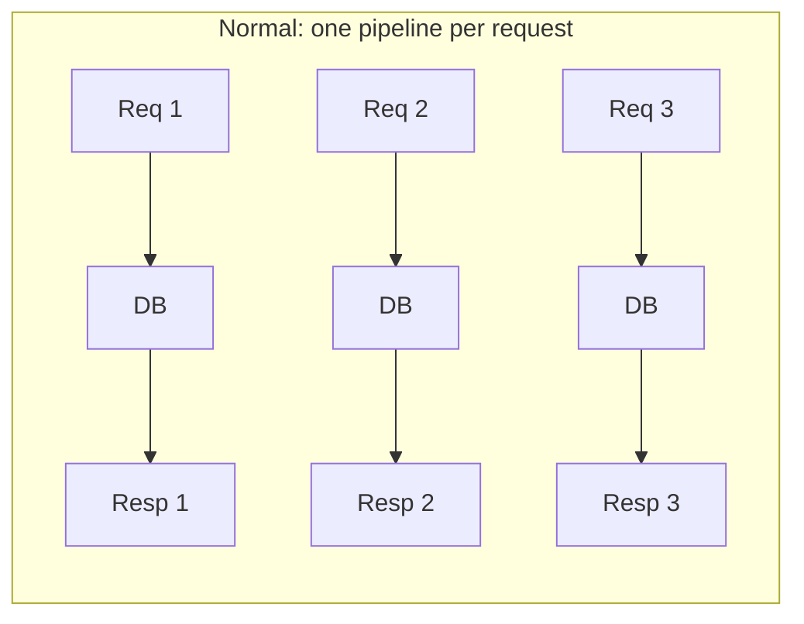
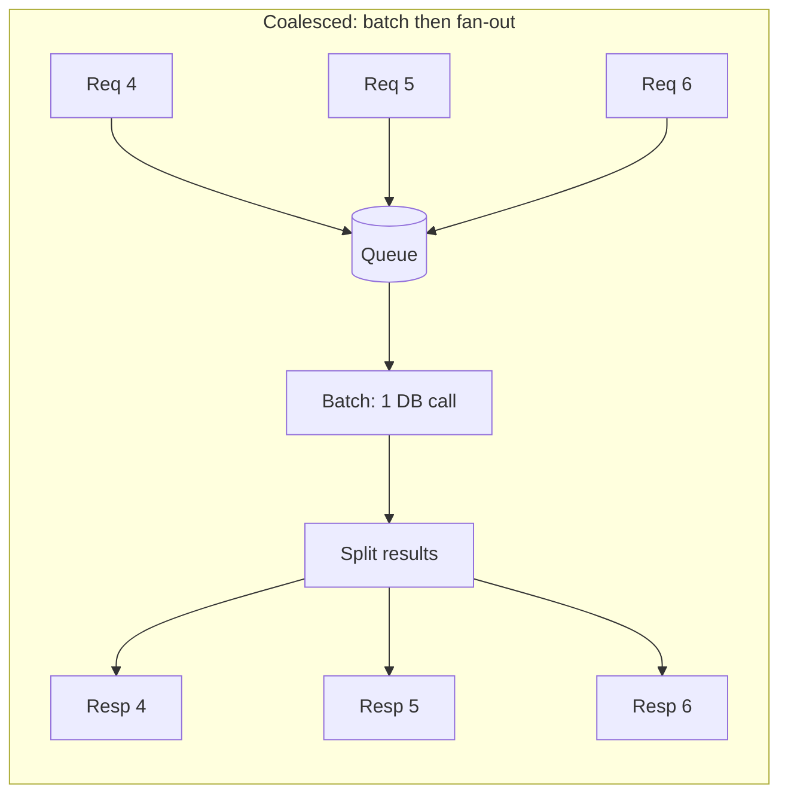
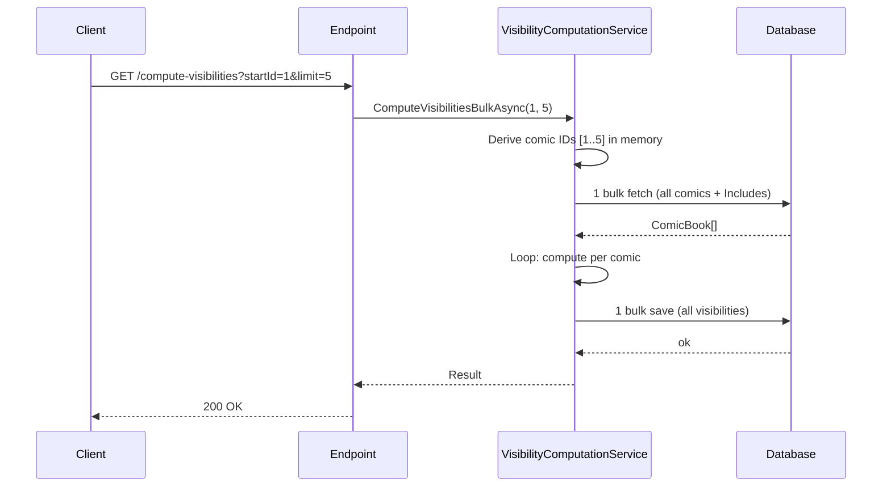
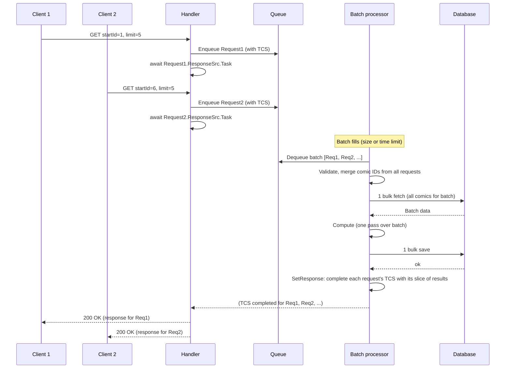
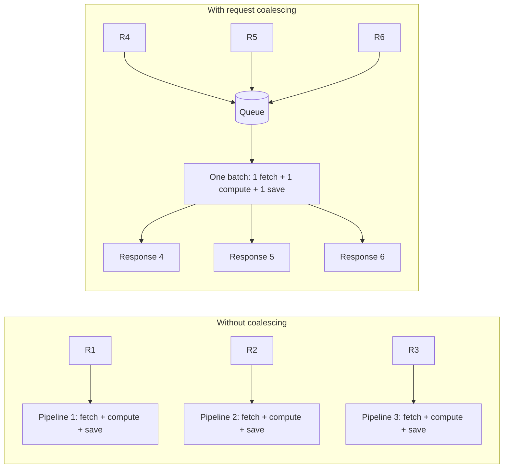

# Request Coalescing

## Expectation

I came across **Discord’s engineering blog** where they describe their **data-service** using **request coalescing** to fetch messages from the database: instead of one DB round-trip per client request, they batch many incoming requests and serve them with fewer, larger fetches. It’s a backend design pattern—same idea as bulk loads or batch inserts, but applied at the request boundary.

I wanted to see what impact this pattern would have if a normal API used it. In this repo I compare two implementations of the same endpoint:

- **OOP API (baseline):** no request coalescing; each HTTP request runs its own pipeline.
- **DOD API (coalesced):** request coalescing enabled via queue + batch processor.

This article is what I tried and what I measured.

**What request coalescing is:** When many clients hit the same kind of work at once (e.g. “give me data for these IDs”), instead of running one pipeline per request you collect requests over a short time window, process them together in a **batch** (one DB round-trip, one compute pass), then map results back to each caller. You trade a bit of queueing delay for fewer DB round-trips and less per-request overhead. In backend terms, that’s request coalescing (or request batching).

My expectation going in was simple: higher throughput under load, and less overall per-request overhead by doing work in batches.

Higher throughput: in many backend systems the bottleneck under concurrency is I/O. If I reduce the number of expensive I/O calls (DB round-trips) by batching, the server should be able to complete more work per unit time before it saturates.

Latency: batching adds a bit of queueing delay because each request has to wait until the batch is formed. So I expected average and tail latency to be *slightly higher* at the margin (bounded by the max wait time) even if throughput improves.

I didn’t expect magic, but I did expect enough improvement to justify the added complexity (queue, batch logic, mapping results back).

---

## Motivation: Request coalescing

The inspiration came from [**Discord’s engineering blog**](https://discord.com/blog/how-discord-stores-trillions-of-messages): their **data-service** uses request coalescing to fetch messages—many clients asking for data get batched into fewer DB round-trips. I wanted to try the same idea on a normal API. Before that, here’s a bit more on what coalescing can look like and how it differs from the usual flow.

### Normal flow vs coalesced flow

In the **normal** flow, every request gets its own pipeline. Concurrent requests don’t share work: N clients mean N DB calls (and N compute passes, if each request does its own).

In a **coalesced** flow, requests are grouped before hitting the heavy resource (e.g. the database). One batch of work is done once; results are then split and returned to the right callers.

So the trade-off: you add a **queueing** step and a **mapping** step (which result goes to which request), and in return you do fewer round-trips and less repeated work when traffic is concurrent.

### Different ways to coalesce

Coalescing can be implemented in a few ways; the choice affects latency and throughput.

- **Time-window (fixed window):** Collect all requests that arrive in the next N milliseconds, then process that set in one go. Simple, but if traffic is sparse you might add latency (e.g. a single request waits up to N ms). Good when you have steady, bursty traffic.

- **Batch size + max wait (what we used):** Try to fill a batch of size N (e.g. 10 requests). If the queue fills up before that, process immediately; if not, process whatever you have after a short max wait (e.g. 5 ms). So you don’t wait forever for a full batch, but under load you still pack many requests per batch. This balances latency (low wait when traffic is low) and throughput (bigger batches when traffic is high).

- **Key-based / deduplication:** Multiple requests for the *same* key (e.g. same resource ID, same query) are merged into one backend call; all waiters get the same result. Common in caches and read-through layers (e.g. “many callers ask for user X → one fetch, then fan-out”). Best when you expect duplicate requests for the same key.

In this experiment I used the **batch size + max wait** approach on the DOD implementation: a background loop dequeues up to 10 requests or waits up to 5 ms, then runs one DB fetch and one compute pass for the batch and maps results back. The OOP implementation is the non-coalesced baseline.

I decided to try it on a small API: an endpoint that computes visibility for a range of comics (each request asks for a few comic IDs). Under load, many requests would hit the same kind of work—fetch data, compute, maybe save. I added a queue and a background batch processor, then compared it to the version that handled each request on its own. 

---

## Setup: Comic visibility scenario (fabricated but practical)

To test this, I used a fabricated backend scenario that is still close to real production patterns.

Imagine an API that computes comic book visibility based on:

- geography rules
- customer segment rules
- release timing
- pricing and other content flags

Each request asks for visibility of multiple comics (e.g. `startId` and `limit`). During load, many requests come in around the same time.

- In **OOP baseline**, requests are handled independently.
- In **DOD coalesced**, incoming requests are enqueued and a background processor handles them in batches.

### Baseline: OOP (no coalescing)

- One request processed at a time: each HTTP call runs its own pipeline (one bulk fetch, compute, one bulk save). No sharing across concurrent requests.
- 10 concurrent clients mean 10 separate DB round-trips and 10 separate compute passes.

### Coalesced: DOD request batching

- Incoming requests are enqueued; a background processor dequeues them in **batches** (see next section for how batching works).
- One bulk fetch and one bulk save per batch; one compute pass over the batch. Results are mapped back to each original request via an index map so every client gets the right response.

The next section has sequence diagrams and the concrete batching logic from the implementation.

---

## Architecture

The main difference is *when* work runs and *how many* requests share one DB round-trip. Below is the flow for each design, then the batching details from the implementation.

### OOP baseline (without coalescing): one request, one pipeline

Each HTTP request is handled on its own. The endpoint calls the service and waits for the full computation. There is no batching across requests: 10 concurrent clients mean 10 separate pipelines, each doing its own fetch and save.

So for one request we do **1 fetch + 1 save**. Under load we still have **one pipeline per request**: no sharing of work across concurrent requests.

### DOD coalesced implementation: queue and batch processor

In DOD, the HTTP handler does **not** do the full work. It validates the request, enqueues a small message (with a `TaskCompletionSource` so the HTTP call can wait), and returns only when that request has been processed as part of a **batch**. A background host dequeues requests in batches, merges all their comic IDs, does **one** fetch and **one** save for the whole batch, then completes every request in that batch by setting their result on the TCS. So multiple HTTP requests share one DB round-trip and one compute pass.

The batch processor keeps an **originalIndices** map so it knows which slice of the batch result belongs to which enqueued request. When it calls `SetResponse`, it completes each request’s `TaskCompletionSource` with the right response. The handler’s `await request.ResponseSrc.Task` then returns and the HTTP response is sent.

### How batching works (from the code)

The batch processor is built on a small queue abstraction. Here’s how batching is implemented so that we don’t wait forever for a full batch, but we still group requests when traffic is high.

- **Queue:** A `ConcurrentQueue<T>`. Each incoming request is turned into a message (with a `TaskCompletionSource`) and **enqueued**; the HTTP handler then awaits the TCS.

- **Dequeue(batchSize):** To form a batch, we try to fill a list with up to `batchSize` items (e.g. 10). We loop: `TryDequeue` and add to the batch. If the queue is **empty**, we don’t return immediately—we allow a short **max batching time** (e.g. **5 ms**) so that a few more requests can arrive. So we return when either we have `batchSize` items or 5 ms has passed, whichever comes first. That way we don’t add too much latency when traffic is low (we process whatever we have after 5 ms), and we pack more work per batch when traffic is high.

- **BatchDequeue loop:** A long-running loop runs in the background. Each iteration:
  1. Calls `Dequeue(batchSize)` to get a batch (up to 10 items, or less after a 5 ms wait).
  2. If the batch is empty (no requests arrived in that window), we count empty cycles; after **5 consecutive empty dequeues**, we increase the pacing period (e.g. to **2 ms**) so the next batches don’t resume too aggressively after idling.
  3. If the batch has items, we invoke the **callback** with `(batchCount, messageBatch)`. In code this callback is triggered by the queue loop (not awaited in that loop), and it performs the single bulk fetch, compute, bulk save, then `SetResponse` for each request in the batch.
  4. After processing a batch, the loop applies pacing between batch iterations: it optionally waits a small computed delay (0 ms normally, ~2 ms after repeated empty dequeues).

So the main knobs are: **batch size** (e.g. 10 requests per batch) and **max batching time** (5 ms) in `Dequeue`, plus (1) an **idle backoff** that increases pacing after repeated empty dequeues. In this experiment the API used `batchSize = 10`; the exact values can be tuned for latency vs throughput.

### Side-by-side: where the difference comes from

**Without coalescing** = one pipeline per request (each with its own fetch and save). **With request coalescing** = many requests enqueued, then processed in batches so many requests share one fetch and one save.

---

## System configuration

Minimal context for the numbers below (same machine for APIs, DB, and metrics unless noted):

- **Runtime:** .NET 8 (ASP.NET Core), EF Core + **MySQL 8.0** (`comicdb` via Docker Compose).
- **Services:** **OOP** API `http://localhost:8080`, **DOD** API `http://localhost:8081`; each API container **8 CPUs / 8 GiB** (`docker-compose.yml` / `docker-compose.dod.yml`).
- **Load generator:** **k6** run on the **host** against those URLs (not inside the API containers).
- **Observability:** Prometheus + Grafana on the same compose stack (used for throughput/latency panels in the detailed result write-ups).

---

## Load test results

I ran the same staged k6 load profile against both implementations (OOP baseline vs DOD coalesced) to compare effective throughput and latency under concurrent load.

### Test setup

These updated results come from **`k6/load-test.js`** (staged VUs). The script mixes:

- health checks
- single-comic visibility computation
- bulk visibility computation
- invalid-request handling

Both APIs are exercised via the same endpoint (`/api/comics/compute-visibilities`) with the same traffic model; only the backend implementation differs.

Timeout language is important:

- **Server timeout:** API returns **504** when its server-side timeout is exceeded (both OOP and DOD use a **~2s** application timeout on this endpoint).
- **Client timeout (k6):** `load-test.js` uses a larger client HTTP timeout so we can observe server 504s if they happen.

In the latest staged runs captured in `docs/oop-load-test-results.md` and `docs/dod-load-test-results.md`, **no timeouts were observed** (error checks succeeded, 0.00% failed HTTP requests).

### Results

**Without coalescing (OOP baseline, `API_URL=http://localhost:8080`):**

- Throughput (effective request rate): **~127.5 req/s** (`http_reqs` 26,777 total)
- Avg latency: **~79.9 ms** | p95 latency: **~178.0 ms** (`http_req_duration`)
- Errors/timeouts: **0.00%** (all checks succeeded; `http_req_failed` was 0)

**With request coalescing (DOD, `API_URL=http://localhost:8081`):**

- Throughput (effective request rate): **~196.3 req/s** (`http_reqs` 41,225 total)
- Avg latency: **~44.4 ms** | p95 latency: **~68.0 ms** (`http_req_duration`)
- Errors/timeouts: **0.00%** (all checks succeeded; `http_req_failed` was 0)

Compared under the same staged load profile, DOD delivered:

- **~1.5× higher throughput** (req/s)
- **~2.6× lower p95 latency** (178ms → 68ms)

The improved latency and throughput come **directly from request coalescing**: batching incoming requests (batch size 10, up to ~5 ms to form a batch), then one DB round-trip and one compute pass per batch, followed by fan-out to each waiting request.

### Max throughput

I also ran **`k6/load-test-max-throughput.js`**: **ramping-arrival-rate** to a **300 req/s** target, steady calls to `GET /api/comics/compute-visibilities?startId=1&limit=5` (OOP on **8080**, DOD on **8081**). Grafana panels and notes are in `docs/oop-load-test-results.md` and `docs/dod-load-test-results.md`.

| Metric | OOP (no coalescing) | DOD (request coalescing) |
|--------|--------------------:|-------------------------:|
| Offered arrival rate (target) | 300 req/s | 300 req/s |
| Peak **200 OK** rate (before cliff) | ~**62** req/s | ~**286** req/s |
| After cliff | **504** ≈ offered rate (~300 req/s) | **504** ≈ offered rate (~300 req/s) |
| Mean **200** rate over full run* | ~**8** req/s | ~**53** req/s |
| Latency at saturation | **200** tail very slow (e.g. p95 ~**15s**); **504** p99 ~**4s** | **p95 / p99** plateau ~**2s** (timeout wall) |

\*Mean 200 over the whole chart is low because most wall-clock time is spent past the breaking point, where successes are rare.

**Interpretation:** Under the **same** aggressive arrival profile, DOD sustained successful responses into the **high-200s req/s** before hitting the **2s** timeout wall; OOP lost **200** around **~60 req/s**. That is roughly a **~4.5×** higher peak “green” throughput for DOD in this test. Both implementations eventually **504 at line rate** if you keep offering **300 req/s** past capacity—the difference is **where** the cliff appears. The gentler **`load-test.js`** runs (~127 vs ~196 req/s) sit **below** both cliffs, which is why they stayed all-200.

### Latency explanation (why latency dropped even though batching waits)
Coalescing introduces a small bounded wait while requests accumulate into a batch (the queue drains with a max batching time of ~5 ms). The key difference is that the expensive work is amortized:

- the coalesced path reduces DB round-trips per request
- it reduces per-request allocation churn

As a result, the system spends less time in GC and less time waiting on overloaded I/O, so both avg latency and tail latency improve substantially (especially p95).

### GC and memory

I also compared garbage collection and allocation. The coalescing version did better (based on `docs/dod-load-test-results.md` and `docs/oop-load-test-results.md`):

- **Gen 0 collections normalized by load**
  - OOP (baseline): mean **110** Gen0 collections per 1000 requests (max 122)
  - DOD (coalesced): mean **1.72** per 1000 requests (max 1.82)
- **GC pause time ratio**
  - OOP: mean **0.814%**, max **2.82%**
  - DOD: mean **0.0694%**, max **0.230%**
- **Allocation**
  - DOD: allocated mean **70.9 MiB** (max 221 MiB), total allocation ~**6 GiB** over the run
  - OOP: allocated volume rises into **GiB scale** territory and stays high under load

Fewer allocations and less GC activity mean fewer stop-the-world pauses and more headroom for tail latency over longer runs. Processing a batch in one pass tends to reduce per-request allocation churn.

---

## What I learned

1. **The biggest gain came from I/O and batching.**  
   Coalescing requests and doing one DB round-trip and one compute pass per batch amortized the expensive work, increasing effective throughput (~1.5× in the staged load runs) while substantially reducing latency (p95 ~2.6× lower). That’s request coalescing doing the heavy lifting.

2. **Batching parameters matter.**  
   Batch size (e.g. 10), max time to wait for a full batch (5 ms), and idle backoff when the queue is empty (2 ms after repeated empty dequeues) trade off latency vs throughput. Worth tuning for your workload.

3. **Trade-offs are real.**  
   Coalescing adds queueing delay (requests wait until their batch is formed and processed), mapping logic (which result goes to which request), and operational tuning. Worth it when the payoff is there.

4. **The pattern is reusable.**  
   Same idea as Discord’s data-service: batch reads (or writes) at the request boundary to cut DB round-trips. You can apply it to other read-heavy or write-heavy endpoints.

---

## When coalescing helps (and when it doesn’t)

A short rule of thumb: coalescing shines when the cost is dominated by **number of round-trips** and each request does **small I/O**; it helps less when each request already does **large I/O** or when **latency of a single request** matters more than throughput.

### Scenarios where request coalescing is useful

- **Read-heavy APIs with small payloads per request** — e.g. “fetch metadata for these N IDs,” “get messages for this channel,” “resolve these user handles.” Many small, similar reads can be merged into fewer bulk queries; you cut round-trip count and use the DB connection and network more efficiently.
- **Write-heavy workloads with small inserts/updates** — e.g. event ingestion, audit logs, or “mark these items as seen.” Batching writes (bulk insert, batch update) reduces round-trips and often improves DB throughput.
- **Concurrent traffic to the same or similar resources** — when many clients hit the same endpoint or the same kind of query at once, there’s natural opportunity to batch. Discord’s message fetches are a good example.
- **I/O-bound services where the bottleneck is DB or network round-trips** — if profiling shows most time in “waiting on DB” or “number of queries,” coalescing can directly address that.

### Scenarios where request coalescing is less useful (or harmful)

- **Each request already reads or writes a lot of data** — e.g. “download this large report,” “stream this blob.” The bottleneck is often bandwidth or single-query cost; batching doesn’t reduce round-trips much and can increase memory and latency (one huge batch).
- **Strict single-request latency requirements** — e.g. a user-facing call that must respond in under 50 ms. Coalescing adds queueing delay (wait for batch to fill or timer) and can push tail latency up. Good for throughput, not always for p99 of a single request.
- **Traffic is sparse or highly variable** — if requests are rare or each request is very different (different keys, different shapes), batches stay small or hard to form; you pay the complexity and queueing cost without the benefit of big batches.
- **Workload is already CPU-bound** — if the bottleneck is in-app computation rather than I/O, batching I/O won’t help much; you might need to optimize the compute path or scale out instead.

---

### Code
Github Repo: https://github.com/Pbasnal/Experiments/tree/master/dotnet-tut/ComicApiOop

---

## Conclusion

**My takeaway:** Request coalescing is worth the effort when it fits the problem. **When each request does small reads or writes per I/O call** (e.g. a few rows, a few IDs), coalescing pays off: you reduce the number of round-trips and use network bandwidth more efficiently by packing many small operations into fewer, larger calls. **When each request already moves a lot of data in every I/O call**, coalescing is less beneficial—the bottleneck is often bandwidth or single-call cost, not the number of round-trips, so batching doesn't buy you as much. So the pattern fits best when the workload is many small, similar I/O operations that can be batched without blowing up payload size.

I’m still learning, and I don’t want to present this as “the correct way.” It’s what I tried and what I measured. If you have experience with request coalescing, batching, or backend performance, I’d be glad to hear what you’d do differently or where this design might run into trouble at scale.

