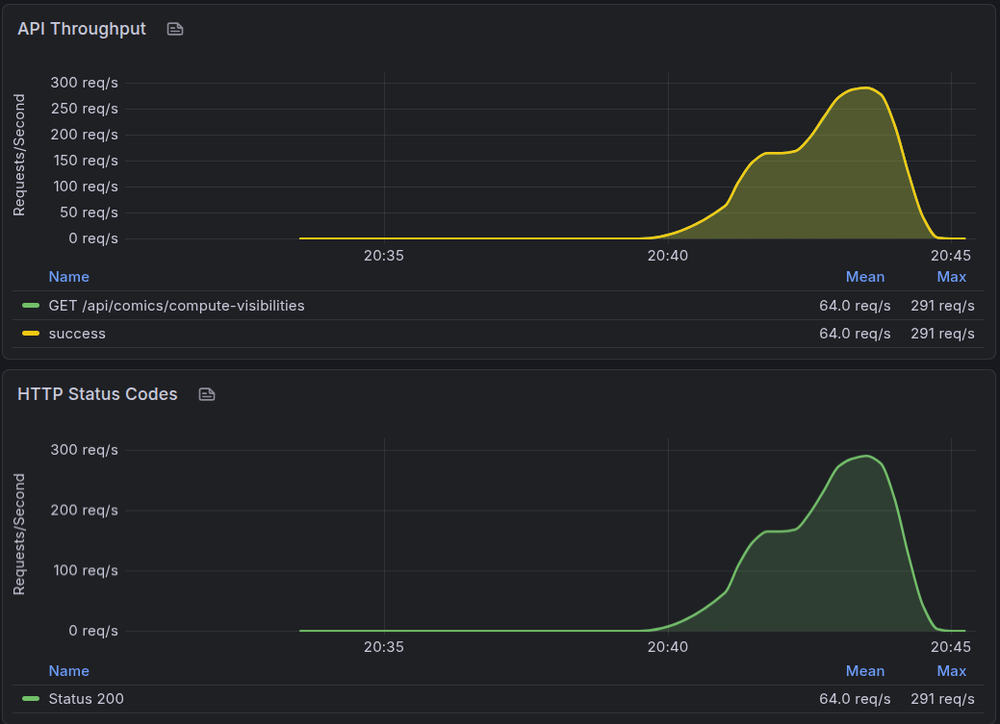
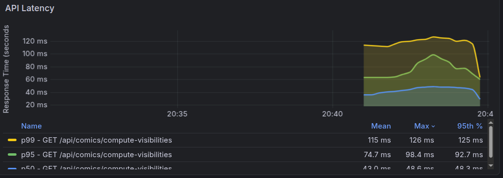
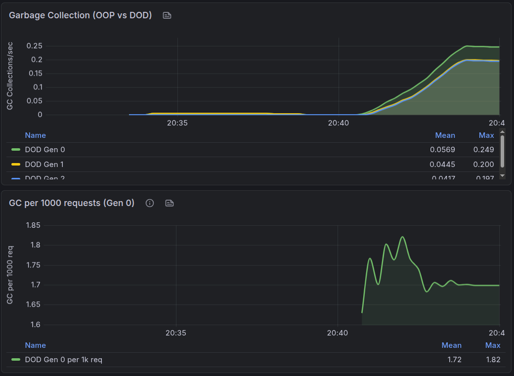
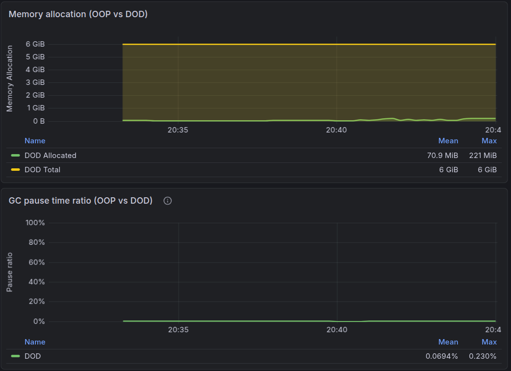
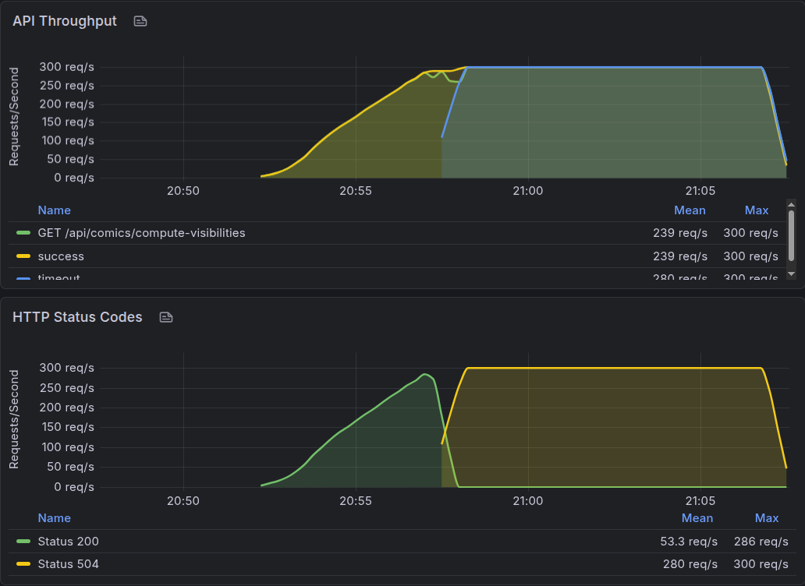
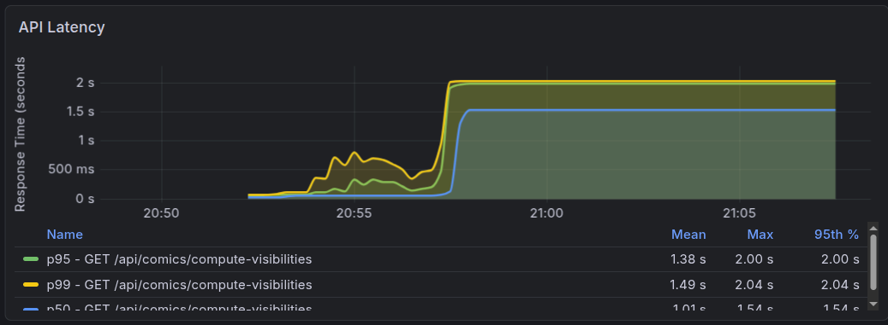

  ~/c/R/Experiments/d/ComicApiOop   master !6 ❯ k6 run --env API_URL=http://localhost:8081 k6/load-test.js             

         /\      Grafana   /‾‾/  
    /\  /  \     |\  __   /  /   
   /  \/    \    | |/ /  /   ‾‾\ 
  /          \   |   (  |  (‾)  |
 / __________ \  |_|\_\  \_____/ 

     execution: local
        script: k6/load-test.js
        output: -

     scenarios: (100.00%) 1 scenario, 20 max VUs, 4m0s max duration (incl. graceful stop):
              * default: Up to 20 looping VUs for 3m30s over 5 stages (gracefulRampDown: 30s, gracefulStop: 30s)

  █ THRESHOLDS 

    comic_visibility_computation_duration
    ✓ 'p(95)<1000' p(95)=68ms

    errors
    ✓ 'rate<0.1' rate=0.00%

    http_req_duration
    ✓ 'p(95)<500' p(95)=67.96ms

  █ TOTAL RESULTS 

    checks_total.......: 247350  1177.770381/s
    checks_succeeded...: 100.00% 247350 out of 247350
    checks_failed......: 0.00%   0 out of 247350

    ✓ compute visibility status is 200
    ✓ compute visibility not timeout
    ✓ compute visibility has results
    ✓ compute visibility has computed visibilities
    ✓ compute visibility processed count matches limit
    ✓ computation duration is reasonable

    CUSTOM
    comic_visibility_computation_duration...: avg=44.38ms min=14ms    med=42ms    max=389ms    p(90)=58ms    p(95)=68ms   
    errors..................................: 0.00%  0 out of 0

    HTTP
    http_req_duration.......................: avg=44.37ms min=14.26ms med=41.82ms max=388.27ms p(90)=58.18ms p(95)=67.96ms
      { expected_response:true }............: avg=44.37ms min=14.26ms med=41.82ms max=388.27ms p(90)=58.18ms p(95)=67.96ms
    http_req_failed.........................: 0.00%  0 out of 41225
    http_reqs...............................: 41225  196.295064/s

    EXECUTION
    iteration_duration......................: avg=65.49ms min=35.35ms med=62.92ms max=411.13ms p(90)=79.35ms p(95)=89.13ms
    iterations..............................: 41225  196.295064/s
    vus.....................................: 1      min=1          max=20
    vus_max.................................: 20     min=20         max=20

    NETWORK
    data_received...........................: 848 MB 4.0 MB/s
    data_sent...............................: 4.9 MB 24 kB/s

running (3m30.0s), 00/20 VUs, 41225 complete and 0 interrupted iterations
default ✓ [======================================] 00/20 VUs  3m30s

## Api Throughput and Http Status Codes

## GC Metrics
### What these GC/memory numbers mean (DOD)

From `dod-gc-1.png` and `dod-mem-gc-pause.png`, DOD shows low GC pressure and very small GC impact on latency:

- **GC collections (per second)**
  - **Gen 0:** mean **0.0569 collections/sec**, max **0.249/sec**
  - **Gen 1:** mean **0.0445 collections/sec**, max **0.200/sec**
  - Interpretation: fewer collections generally means less allocation churn. Lower and steadier Gen 0/Gen 1 collection rates suggest the batching/coalescing work path is producing less short-lived garbage.

- **GC collections normalized by load**
  - **Gen 0 per 1000 requests:** mean **1.72**, max **1.82**
  - Interpretation: this normalization is what you want for comparing under different traffic levels. Staying around ~1–2 Gen 0 collections per 1000 requests means GC activity scales with load rather than exploding.

- **Memory allocation**
  - **Allocated:** mean **70.9 MiB**, max **221 MiB**
  - **Total allocation:** ~**6 GiB** (range shown as mean **6 GiB** / max **6 GiB** on the panel)
  - Interpretation: allocated memory staying relatively flat (no runaway growth) indicates there’s no leak/unbounded retention. A higher max near the end typically corresponds to peak workload / warmup effects, not sustained growth.

- **GC pause time ratio (latency impact)**
  - mean **0.0694%**, max **0.230%**
  - Interpretation: the pause ratio is the fraction of time the runtime spends stopped for GC. A mean below 0.1% and a low max indicates GC pauses are unlikely to be the dominant contributor to end-to-end latency or tail spikes.

## Max Throughput

Test: `k6/load-test-max-throughput.js` with **`ramping-arrival-rate`** — ramp to the configured target RPS (here **300 req/s**), then hold at that rate. Each iteration calls `GET /api/comics/compute-visibilities?startId=1&limit=5` with a **12s** client timeout so **504** responses from the server are visible.

**API Throughput / HTTP status (what the panel shows)**  
- Total throughput for the endpoint ramps from **0 → 300 req/s** and then stays at **300 req/s** for the steady phase.  
- **200 OK** keeps up with the ramp until roughly the high-200s req/s range (panel max **~286 req/s** for status 200), then **collapses to ~0** once the server is overloaded. The **mean** 200 rate over the *entire* chart window can look modest (e.g. ~50 req/s) because most elapsed time is the long steady phase where **every** request is a **504**.  
- **504** appears at the same inflection: the rate of timeouts quickly rises to match the full **300 req/s** target, meaning **almost every request times out** for the remainder of the run under that sustained arrival rate.  
- **Takeaway:** under this fixed workload (`startId=1`, `limit=5`), the DOD API **stops succeeding sustainably before the full 300 req/s target**; beyond that point the queue + **2s** server-side wait on the batched response is exceeded, so Grafana shows **504 at line rate**.

  
**API latency (p50 / p95 / p99)**  
- Early in the run, latency stays low while the server is within capacity.  
- As arrival rate approaches the breaking point, percentiles rise; then there is a **sharp step** into a long **flat plateau**.  
- **p95 and p99 sit at ~2.0s** on the plateau — matching the **application timeout** on the compute-visibilities path (server returns **504** after **2 seconds** when the `TaskCompletionSource` does not complete in time).  
- **p50 ~1.5s** on the plateau indicates that even “typical” requests are heavily delayed (queueing behind batch processing and saturation), not just tail traffic.

**How to read the two graphs together**  
Throughput shows **when** success flips to timeout at scale; latency shows **why** it looks like a wall: once saturated, responses cluster at the **timeout boundary (~2s)** instead of growing smoothly — classic sign of **time-bounded failure** under excessive arrival rate.

**Practical interpretation**  
- For this scenario, **~280–300 req/s sustained arrival** is **above** what this instance can serve with high success; the system needs **lower target RPS**, **more capacity** (CPU/DB/parallel batch workers), or **tuning** (batch size, inter-batch delay, timeout) to hit 300 req/s cleanly.  
- The **staged `load-test.js` run** earlier in this doc (~**196 req/s**, no failures) sits **below** this breaking point — the max-throughput test is what finds the **cliff**.

