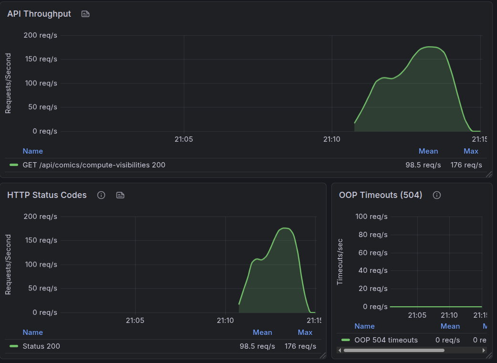
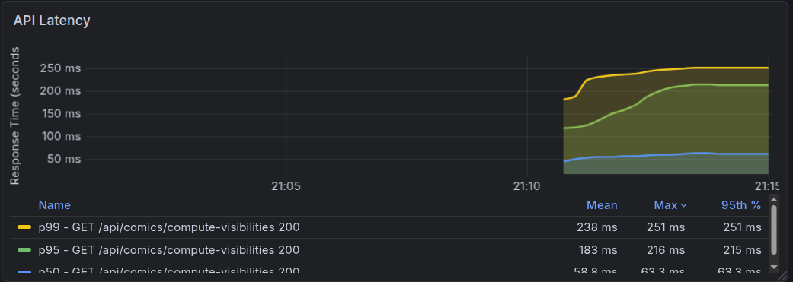
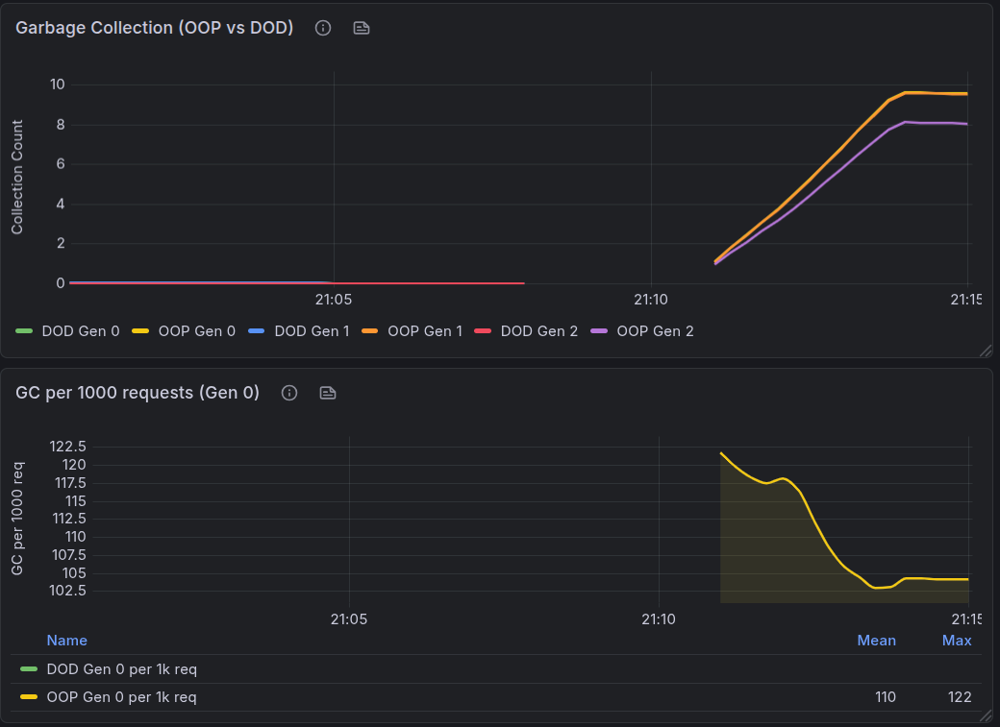
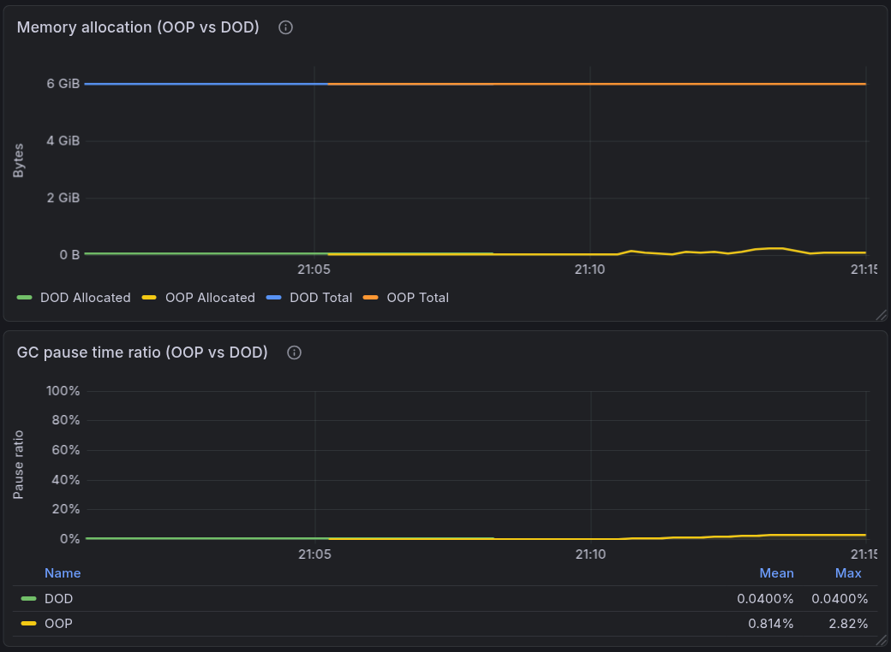
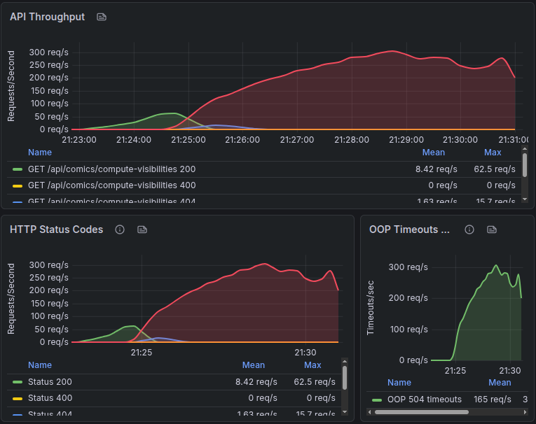
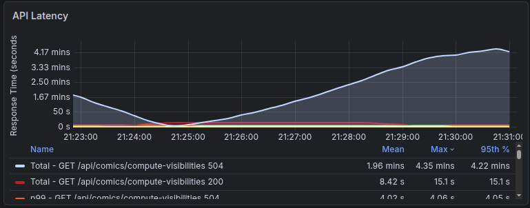

  ~/c/R/Experiments/d/ComicApiOop   master !6 ?5 ❯ k6 run --env API_URL=http://localhost:8080 k6/load-test.js        

         /\      Grafana   /‾‾/  
    /\  /  \     |\  __   /  /   
   /  \/    \    | |/ /  /   ‾‾\ 
  /          \   |   (  |  (‾)  |
 / __________ \  |_|\_\  \_____/ 

     execution: local
        script: k6/load-test.js
        output: -

     scenarios: (100.00%) 1 scenario, 20 max VUs, 4m0s max duration (incl. graceful stop):
              * default: Up to 20 looping VUs for 3m30s over 5 stages (gracefulRampDown: 30s, gracefulStop: 30s)

  █ THRESHOLDS 

    comic_visibility_computation_duration
    ✓ 'p(95)<1000' p(95)=178ms

    errors
    ✓ 'rate<0.1' rate=0.00%

    http_req_duration
    ✓ 'p(95)<500' p(95)=178.03ms

  █ TOTAL RESULTS 

    checks_total.......: 160662  765.015602/s
    checks_succeeded...: 100.00% 160662 out of 160662
    checks_failed......: 0.00%   0 out of 160662

    ✓ compute visibility status is 200
    ✓ compute visibility not timeout
    ✓ compute visibility has results
    ✓ compute visibility has computed visibilities
    ✓ compute visibility processed count matches limit
    ✓ computation duration is reasonable

    CUSTOM
    comic_visibility_computation_duration...: avg=79.97ms  min=17ms    med=63ms    max=673ms    p(90)=147ms    p(95)=178ms   
    errors..................................: 0.00%  0 out of 0

    HTTP
    http_req_duration.......................: avg=79.89ms  min=17ms    med=62.99ms max=672.48ms p(90)=146.45ms p(95)=178.03ms
      { expected_response:true }............: avg=79.89ms  min=17ms    med=62.99ms max=672.48ms p(90)=146.45ms p(95)=178.03ms
    http_req_failed.........................: 0.00%  0 out of 26777
    http_reqs...............................: 26777  127.5026/s

    EXECUTION
    iteration_duration......................: avg=100.85ms min=37.86ms med=83.78ms max=693.48ms p(90)=167.83ms p(95)=199.26ms
    iterations..............................: 26777  127.5026/s
    vus.....................................: 1      min=1          max=20
    vus_max.................................: 20     min=20         max=20

    NETWORK
    data_received...........................: 186 MB 883 kB/s
    data_sent...............................: 3.2 MB 15 kB/s

running (3m30.0s), 00/20 VUs, 26777 complete and 0 interrupted iterations
default ✓ [======================================] 00/20 VUs  3m30s

## Api Throughput and Http Status Codes

## GC Metrics
### What these GC/memory numbers mean (OOP)

In `oop-gc-1.png` and `oop-mem-gc-pause.png`, OOP shows higher GC activity and a much larger GC pause impact than DOD.

- **GC collections normalized by load (Gen 0 per 1000 requests)**
  - **OOP:** mean **110**, max **122**
  - Interpretation: OOP creates far more short-lived garbage per request, so Gen 0 collections scale up sharply under load.

- **GC pause time ratio (fraction of time paused for GC)**
  - **DOD:** mean **0.0400%**, max **0.0400%**
  - **OOP:** mean **0.814%**, max **2.82%**
  - Interpretation: OOP spends ~10–20x more time paused for GC than DOD, and it has a noticeable max spike. This is the kind of behavior that usually worsens tail latency (p95/p99) under higher throughput.

- **Memory allocation (allocated vs total)**
  - `oop-mem-gc-pause.png` shows **DOD allocated ~near zero**, while **OOP allocated rises to GiB scale** and stays high.
  - Interpretation: higher allocated heap volume aligns with the higher GC frequency/pauses—OOP is retaining or producing more objects, leading to more GC churn.

## Max Throughput

Test: `k6/load-test-max-throughput.js` with **`API_URL=http://localhost:8080`** (OOP API). Same scenario as the DOD max run: **`ramping-arrival-rate`** to **300 req/s** target, then hold. Each iteration calls `GET /api/comics/compute-visibilities?startId=1&limit=5` with a **12s** k6 HTTP timeout so **504** responses are visible.

**API Throughput / HTTP status / OOP timeouts (what the panels show)**  
- **200 OK** only keeps up during the early ramp: success peaks around **~62 req/s**, then **collapses toward zero** once load increases further. The **mean** 200 rate over the full window is very low (**~8 req/s**) because most of the timeline is the saturated phase where the server is not completing work successfully at the requested arrival rate.  
- **504** rises in step with overload and eventually tracks the **full target load (~300 req/s)** for long stretches — same pattern as DOD (timeouts at line rate once past capacity), but OOP hits that regime **much sooner** (success dies off while still in the **tens** of req/s, not the high-200s).  
- **404** appears as a **small secondary spike** (on the order of **~16 req/s** max, low mean). Worth a quick sanity check (routing, base URL, or a transient upstream) if you expect only 200/400/504 on this path.  
- **400** stays flat at zero in this run.  
- The **OOP Timeouts** panel tracks **504** in parallel with the status-code view, confirming failures are dominated by **gateway timeouts** from the OOP service under sustained arrival rate.

**Takeaway (throughput):** For this fixed workload (`startId=1`, `limit=5`), the **non-coalesced OOP** implementation **cannot sustain** the same success envelope as DOD under an aggressive ramp to **300 req/s**; successful throughput tops out near **~60 req/s** before the run becomes **504-heavy**.

**API latency (200 vs 504)**  
- **200 OK** latency stays **much lower** than the failing path in aggregate, but under stress the successful tail is still poor: the panel shows **mean ~8.4s** and **p95 / max ~15s** for 200s — requests that *do* complete are already **deeply queued / slow** right before and around the failure window.  
- **504** series: one view shows **p99 ~4s** for timed-out requests (in the ballpark of **client + server timeout behavior** rather than sub-second happy path). Another aggregated **504 “total”** series in the same dashboard can show **very large** means/maxes (minutes-scale) depending on how the metric is defined (e.g. queue wait, retries, or panel math) — treat that as a **sign of severe backlog / client-side wait**, not as “the server took 4 minutes per request” unless you confirm the metric definition in Grafana.  
- **Visually:** as load ramps past what OOP can serve, you see **latency divergence**: healthy 200s (when any exist) vs a **timeout-dominated** regime.

**How to read the two graphs together**  
Throughput shows **how early** OOP loses **200** (on the order of **~60 req/s** peak success vs **300 req/s** offered). Latency shows **stress before and during failure**: even **200** responses become **multi-second**, then **504** dominates at scale.

**Practical interpretation & comparison with the staged run**  
- The **staged `load-test.js`** result above (**~127 req/s**, **0%** `http_req_failed`) uses **mixed traffic** (health, invalid requests, sleeps) and **20 VUs** — effective pressure on the hot path is **lower** than **300 req/s** of steady compute calls, so it can still look “green” while the **max-throughput** test exposes a **cliff**.  
- Versus **DOD** on the same **300 req/s** target: DOD keeps **200** into the **high-200s req/s** before the cliff; **OOP** falls over near **~60 req/s** peak **200** — a large gap and a clear illustration of **why batching/coalescing** helped in this experiment.

