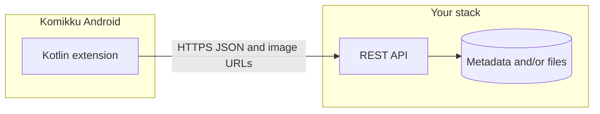

<!-- 4168b5fb-d17f-4211-a5cf-853eb58448fe -->
---
todos:
- id: "spec-api"
  content: "Draft OpenAPI v1: series list/search/detail, chapters, pages; pagination and error model"
  status: pending
- id: "content-model"
  content: "Choose content origin (self-hosted files vs external) and DB/storage layout"
  status: pending
- id: "quarkus-slice"
  content: "Implement vertical slice iån picturetales (REST resources + DTOs + one chapter E2E)"
  status: pending
- id: "media-delivery"
  content: "Add image delivery strategy (CDN, signed URLs, headers)"
  status: pending
- id: "kotlin-extension"
  content: "Create Komikku extension module calling API; settings for baseUrl and auth"
  status: pending
- id: "distribution"
  content: "Package extension repo (index.json) and document install URL for Komikku"
  status: pending
  isProject: false
---
# Backend as a Komikku “source”

## Important clarification (Komikku vs “Kommiku”)

You almost certainly mean **[Komikku](https://github.com/komikku-app/komikku)** (Android manga reader). Komikku discovers **sources** via **installable extensions** (Kotlin, same lineage as Tachiyomi/Mihon), not by pasting a backend URL into the app as a first-class “API source.”

So “add to Komikku as a source” in practice means **one of**:

- **Recommended:** Your **backend + a dedicated Kotlin extension** whose `baseUrl` (or settings) points at your API, or
- **Alternative:** Reuse an existing extension that already targets an API you control or mirror (only works if semantics match; usually you still end up writing an extension).

There is no standard “Komikku plugin JSON” that replaces the extension layer today; the extension is the adapter between Komikku’s `CatalogueSource`-style flow and your HTTP API.

## What Komikku expects from a “source” (functional contract)

Extensions implement a **catalogue flow** roughly equivalent to:

| Reader action | Your backend should support (conceptually) |
|---------------|--------------------------------------------|
| Browse popular / latest | Paginated list of series (id, title, cover, optional description snippet) |
| Search | Query + paginated results |
| Series detail | Full metadata, status, tags, cover |
| Chapter list | Ordered chapters (stable ids, names/numbers, dates if available) |
| Read chapter | Ordered **page list** (each page: image URL or supported scheme the app can load) |

Implementation details (exact Kotlin types, optional filters, headers) live in the extension API used by **[komikku-extensions](https://github.com/komikku-repo/komikku-extensions)** / upstream Mihon extension libraries; your backend only needs to **match whatever the extension maps to**.

## Backend requirements (application + operations)

### 1. API design (versioned, stable JSON)

- **Versioning:** e.g. `/v1/...` or `Accept` header; avoid breaking mobile clients silently.
- **Pagination:** cursor or page+limit; consistent sort order for chapters.
- **Identifiers:** opaque string ids for series/chapters/pages (stable across renames).
- **Errors:** structured JSON errors + meaningful HTTP status codes (401/403/404/429/5xx).

Suggested minimal surface (illustrative, not prescriptive names):

- `GET /v1/health` or `GET /v1/version`
- `GET /v1/series?sort=popular|latest&page=`
- `GET /v1/search?q=&page=`
- `GET /v1/series/{id}`
- `GET /v1/series/{id}/chapters`
- `GET /v1/chapters/{id}/pages` → list of `{ "index": n, "url": "..." }` (or inline data URLs only if you accept size/latency tradeoffs)

### 2. Media delivery

- Prefer **absolute HTTPS URLs** for page images (CDN-friendly).
- If files are private: **short-lived signed URLs**, or **token query params** the extension adds from user settings.
- Decide **image formats** (JPEG/WebP) and **size limits** compatible with mobile decoding.
- Optional: **Range requests** / correct `Content-Type` for long strips or non-image assets.

### 3. Data and content layer (your product choice)

You must define **where comics come from**:

- **Self-hosted library** (you ingest CBZ/CBR/PDF, extract metadata, store on disk/object storage), or
- **Aggregator of external sites** (legal/ToS risk; usually scraping and brittle), or
- **Licensed partner API** (cleanest legally, depends on contracts).

The backend implements **catalog + file serving** (or redirects) on top of that choice.

### 4. Security and abuse

- **Authentication:** API keys or OAuth in extension **preferences** (never hardcode secrets in public APKs).
- **Rate limiting** and basic bot protection on public endpoints.
- **TLS** for production; local dev can use HTTP only on LAN with cleartext config (Android-specific).

### 5. Observability and lifecycle

- Structured logging, metrics, tracing for slow chapter/page paths.
- Backup strategy for metadata DB and object storage.
- Deployment: container (you already have Quarkus Dockerfiles under `picturetales/src/main/docker/`) + reverse proxy.

## Komikku-side work (cannot be skipped for “installable source”)

- **Kotlin extension module** in an extensions repo (pattern: [komikku-extensions CONTRIBUTING](https://github.com/komikku-repo/komikku-extensions/blob/master/CONTRIBUTING.md)): implements catalogue methods by calling your REST API and mapping JSON → manga/chapter/page models.
- **Distribution:** either contribute to a community repo or host a **private extension repository** (`index.json` / installer flow Mihon/Komikku already supports for third-party repos).
- **Testing:** install debug build on device/emulator against staging API.

## Alignment with your repo

[`picturetales`](file:///Users/basnal/repos/Experiments/picturetales) is already a **Quarkus + RESTEasy + Jackson** Gradle project — a reasonable place to host the HTTP API and optional persistence (add JDBC/Panache, storage client, etc., when you pick a data model).

## Roadmap (phased)

**Phase 0 — Product and contract (short)**
- Decide content origin (library vs external).
- Write an **OpenAPI** (or markdown) spec for `v1` endpoints and example payloads.
- Sketch extension settings: `baseUrl`, API key, optional filters.

**Phase 1 — Vertical slice on backend**
- Implement `health`, one list endpoint, `series/{id}`, `chapters`, `pages` with **fixture or tiny seed DB**.
- Serve or redirect **one real chapter** end-to-end.

**Phase 2 — Catalogue completeness**
- Popular/latest, search, pagination, cover URLs, metadata fields you care about.
- Chapter ordering rules (fractionals, specials) documented.

**Phase 3 — Media and scale**
- Object storage/CDN integration, signed URLs, caching headers.
- Load testing hot paths (chapter pages).

**Phase 4 — Auth and hardening**
- API keys / JWT, rate limits, admin vs reader scopes if needed.

**Phase 5 — Komikku extension**
- New extension package calling your API; configurable base URL.
- Manual QA in Komikku (browse, search, read, resume, error states).

**Phase 6 — Distribution**
- Staging + production URLs, versioning policy, private or public extension repo, update cadence when API changes.

## Risks and decisions to lock early

- **Legal/content:** hosting third-party scraped comics is often prohibited by site ToS and copyright law; self-hosted or licensed content is safer.
- **Breaking changes:** the mobile extension ships slower than your API; treat `v1` as long-lived or use feature flags.
- **No “backend only” install:** budget time for the **Kotlin extension** and **repo hosting** as part of “done,” not an afterthought.
